# 安装Red Hat OpenShift Service Mesh
Red Hat OpenShift Service Mesh 是一个平台，使用服务网格洞察和操作控制能力对微服务应用程序提供统一的连接、保护和监控。

术语服务网格描述了构成分布式微服务架构中的应用程序的微服务网络以及这些微服务之间的交互。随着服务网格的大小和复杂性的增加，理解和管理变得更加困难。

基于开源 Istio 项目，Red Hat OpenShift Service Mesh 在现有分布式应用程序上添加了透明层，无需对服务代码进行任何更改。就可以通过在整个环境中部署特殊的 sidecar 代理来为服务添加 Red Hat OpenShift Service Mesh 支持，从而拦截微服务之间的所有网络通信。可以使用控制平面功能配置和管理服务网格。

红帽 OpenShift 服务网络提供了一种简单的方法来创建部署的服务网络，提供发现，负载平衡，服务到服务身份验证，故障恢复，指标和监控。服务网格可以提供给应用更复杂的操作功能，其中包括A/B测试，金丝雀部署，速率限制，访问控制和端到端身份验证。
## 红帽OpenShift服务网格产品架构
Red Hat OpenShift Service Mesh 在逻辑上分为数据平面和控制平面：

- 数据平面

	是由一组的部署为sidecar的智能代理。这些代理拦截并控制服务网格中微服务之间的所有入站和出站网络通信; sidecar代理还与通用政策和遥测中心 Mixer 进行通信。

- 控制平面

	是负责管理和配置代理服务器的路由流量，并配置 Mixers，用于执行政策和收集遥测。

组成数据平面和控制平面的组件是：

- `Envoy`

	数据平面组件，它拦截服务网格中所有服务的所有入站和出站流量。特使被部署为同一 pod 内相关服务的sidecar。
- `Mixers`

	控制平面组件，负责实施访问控制和使用策略（例如授权，速率限制，配额，身份验证，请求跟踪）以及从 Envoy 代理和其他服务收集遥测数据。
- `Pilot`

	负责在运行时配置代理的控制平面组件。Pilot 为 Envoy sidecar提供服务发现，为智能路由（例如，A/B测试或金丝雀部署）提供​​流量管理功能，以及弹性（超时，重试和熔断）。
- `Citadel`

	负责证书颁发和轮换的控制平面组件。Citadel 通过内置身份和凭证管理提供强大的服务到服务和最终用户身份验证。可以使用 Citadel 升级服务网格中的未加密流量。使用 Citadel，运营商可以根据服务标识而不是网络控制来实施策略。
	
## 支持的配置
以下是 Red Hat OpenShift Service Mesh 0.8.TechPreview 唯一支持的配置：

- 红帽 OpenShift 容器平台版本3.11。
- 部署必须在单个 OpenShift Container Platform 集群中（无联邦）。
- 此版本的 Red Hat OpenShift Service Mesh 仅适用于 OpenShift Container Platform x86_64。
- 红帽 OpenShift 服务网格仅适用于配置为OpenShift 容器平台软件定义网络（SDN)中的扁平网络模式下，不支持 exteranl provider。
- 此版本仅支持所有服务和网格组件运行在 OpenShift 集群中。不支持在群集外部或多群集方案中的微服务的管理。
- Kiali 可观察性控制台仅在 Chrome，Edge，Firefox或Safari浏览器的两个最新版本中受支持。

有关此技术预览支持的更多信息，请参阅此[Red Hat知识库文章](https://access.redhat.com/articles/3580021)。

## 比较 Red Hat OpenShift Service Mesh 和上游 Istio 社区安装
Red Hat OpenShift Service Mesh 的安装与上游 Istio 社区安装有多种不同。在 OpenShift 上部署时，有时需要对 Red Hat OpenShift Service Mesh 进行修改以解决问题，提供其他功能或处理差异。

以下方面 Red Hat OpenShift Service Mesh 的当前版本与 Istio 社区版本不同
### 自动注射
Istio 社区安装会自动将sidecar注入标记的名称空间。

Red Hat OpenShift Service Mesh 不会自动将 sidecar 注入任何名称空间，但需要管理员指定 `sidecar.istio.io/inject` 注释，如[自动sidecar注入](https://docs.openshift.com/container-platform/3.11/servicemesh-install/servicemesh-install.html#automatic-sidecar-injection)部分所示。
### 基于角色的访问控制功能
基于角色的访问控制（RBAC）提供了一种可用于控制对服务的访问的机制。可以通过用户名或指定一组属性来识别主题，并相提供应用访问控制。

- istio 社区版

	Istio 社区安装仅支持精确请求 header 的匹配，在 header 匹配通配符中或检查包含特定前缀或后缀的 header 的选项。
	
		apiVersion: "rbac.istio.io/v1alpha1"
		kind: ServiceRoleBinding
		metadata:
		  name: httpbin-client-binding
		  namespace: httpbin
		spec:
		  subjects:
		  - user: "cluster.local/ns/istio-system/sa/istio-ingressgateway-service-account"
		    properties:
		      request.headers[<header>]: "value"
- openshift istio		      

	Red Hat OpenShift Service Mesh 通过使用正则表达式扩展了匹配请求 header 的功能。`request.regex.headers` 使用正则表达式指定属性键。
	
		apiVersion: "rbac.istio.io/v1alpha1"
		kind: ServiceRoleBinding
		metadata:
		  name: httpbin-client-binding
		  namespace: httpbin
		spec:
		  subjects:
		  - user: "cluster.local/ns/istio-system/sa/istio-ingressgateway-service-account"
		    properties:
		      request.regex.headers[<header>]: "<regular expression>"

## Red Hat OpenShift Service Mesh 安装概述
Red Hat OpenShift Service Mesh 安装过程创建了两个不同的项目(ns)：

- istio-operator（1个pod）
- istio-system（17个pod）

首先创建一个 operator。这个 operator 定义、监视、管理 Service Mesh 组件的部署，更新和删除的自定义资源。

根据编辑自定义资源文件的方式，可以在安装 Service Mesh 时安装以下一个或多个组件：

- Istio - 基于开源 [Istio](https://istio.io/)，允许连接，保护，控制和观察构成应用程序的微服务。
- Jaeger - 基于开源 [Jaeger](https://www.jaegertracing.io/)，允许执行跟踪以监视复杂分布式系统中的事务并对其进行故障排除。
- Kiali - 基于开源 [Kiali](https://www.kiali.io/)，Kiali 为服务网格提供可观察性。使用 Kiali 可以在单个控制台中查看配置，监控流量以及查看和分析跟踪。
- Launcher - 基于开源 [fabric8](http://fabric8.io/)，该集成开发平台可帮助构建云本机应用程序和微服务。红帽 OpenShift 服务网格包含几个助推器，可让您探索服务网格的功能。

在安装过程中，管理员需要创建一个 Ansible job，该 job 运行 Ansible playbook，自动执行以下安装和配置任务：

- 创建 `istio-system` 项目
- 创建 `openshift-ansible-istio-installer-job` 安装以下组件：
	- istio 组件
		- istio-citadel
		- istio-egressgateway
		- istio-galley
		- istio-ingressgateway
		- istio-pilot
		- istio-policy
		- istio-sidecar-injector
		- istio-telemetry  
	- Elasticsearch
	- Grafana
	- Jaeger 组件:
		- jaeger-agent
		- jaeger-collector
		- jaeger-query
	- Kiali 组件 (如果在自定义资源定义中配置):
		- Kiali
	- Prometheus
	- 3scale 组件 (如果在自定义资源定义中配置):
		- 3scale-istio-adapter
- 执行以下启动程序配置任务（如果在自定义资源定义中配置）：
	- 创建一个 `devex` 项目并将 Fabric8 启动程序安装到该项目中。
	- 将集群管理员角色添加到自定义资源文件中的启动程序参数中指定的 OpenShift Container Platform 用户。

## 先决条件
### Red Hat OpenShift Service Mesh 安装先决条件
在安装 Red Hat OpenShift Service Mesh 之前，必须满足以下先决条件：

- 在 Red Hat 帐户上拥有一个有效的 OpenShift Container Platform 订阅。
- 安装 OpenShift Container Platform 3.11 或更高版本。
- 安装 oc 与 OpenShift Container Platform 版本匹配的 OpenShift Container Platform 命令行实用程序（客户端工具）的版本，并将其添加到路径中。例如，如果有 OpenShift Container Platform 3.11 ，则必须具有匹配的 oc 客户端版本3.11。

### 准备 OPENSHIFT CONTAINER PLATFORM 安装
在将 Service Mesh 安装到 OpenShift Container Platform 安装之前，必须修改 master 配置和每个可调度节点。这些更改启用了 Service Mesh 中所需的功能，并确保 Elasticsearch 功能正常运行。
### 更新节点配置
要运行 Elasticsearch 应用程序，必须更改每个节点上的内核配置。此更改通过 sysctl 服务处理。

在 OpenShift Container Platform 安装中的每个节点上进行以下更改：

- 创建一个 `/etc/sysctl.d/99-elasticsearch.conf` 使用以下内容命名的文件：

		vm.max_map_count = 262144
- 执行以下命令：
		
		$ sysctl vm.max_map_count=262144

## 安装服务网格
### 安装 Red Hat OpenShift 服务网格
安装 Service Mesh 涉及创建自定义资源定义文件，然后安装 operator 以创建和管理自定义资源。
### 创建自定义资源文件
要部署 Service Mesh 控制平面，必须部署自定义资源。一个自定义的资源即是一个扩展 Kubernetes API，或者允许将自己的 API 对象集成到项目或集群。将自定义资源定义为对应对象的yaml文件。然后使用 yaml 文件创建对象。以下示例包含所有受支持的参数，并部署基于Red Hat OpenShift Service Mesh 0.8.TechPreview 镜像。

- 部署包含所有参数的 `istio-installation.yaml` 文件可确保已安装完成本文档中包含的所需的所有 Istio 组件。
- 3scale Istio Adapter 在自定义资源文件中部署和配置。它还需要一个有效的3scale帐户（[SaaS](https://www.3scale.net/signup/)或[内部部署](https://access.redhat.com/documentation/en-us/red_hat_3scale_api_management/2.4/html/infrastructure/onpremises-installation)）。

完整的 `istio-installation.yaml`
 
	apiVersion: "istio.openshift.com/v1alpha1"
	kind: "Installation"
	metadata:
	  name: "istio-installation"
	spec:
	  deployment_type: openshift
	  istio:
	    authentication: true
	    community: false
	    prefix: openshift-istio-tech-preview/
	    version: 0.8.0
	  jaeger:
	    prefix: distributed-tracing-tech-preview/
	    version: 1.9.0
	    elasticsearch_memory: 1Gi
	  kiali:
	    username: username
	    password: password
	    prefix: openshift-istio-tech-preview/
	    version: 0.14.0
	  launcher:
	    openshift:
	      user: user
	      password: password
	    github:
	      username: username
	      token: token
	    catalog:
	      filter: booster.mission.metadata.istio
	      branch: v85
	      repo: https://github.com/fabric8-launcher/launcher-booster-catalog.git
	  threeScale:
	    enabled: false
	    prefix: openshift-istio-tech-preview/
	    version: 0.3.0
	    adapter:
	      listenAddr: 3333
	      logLevel: info
	      logJSON: true
	      reportMetrics: true
	      metricsPort: 8080
	      cacheTTLSeconds: 300
	      cacheRefreshSeconds: 180
	      cacheEntriesMax: 1000
	      cacheRefreshRetries: 1
	      allowInsecureConn: false
	      clientTimeoutSeconds: 10		
以下示例说明了安装控制平面所需的最低要求。此最小示例自定义资源部署基于 CentOS 的社区 Istio 镜像

	apiVersion: "istio.openshift.com/v1alpha1"
	kind: "Installation"
	metadata:
	  name: "istio-installation"
### 自定义资源参数
下表列出了 Red Hat OpenShift Service Mesh 支持的自定义资源参数。
#### 一般参数
参数|值|描述|默认值
---|---|---|--- 
deployment_type|origin、openshift |指定是否对未定义的参数值使用 Origin 或 OCP 默认值。| origin
#### istio 参数
参数|值|描述|默认值
---|---|---|--- 
authentication|true/false|是否启用相互身份验证。|false
community|true/false|是否修改镜像名称以匹配社区镜像。|false
prefix|任何有效的 image repo||如果 `deployment_type=origin` 默认值是 `maistra/`。如果`deployment_type=openshift` 默认值是 `openshift-istio-tech-preview/`。
version|任何有效的 image tag|与 Istio 镜像一起使用的容器镜像 tag。|0.8.0
### jaeger 参数
参数|值|描述|默认值
---|---|---|--- 
prefix|任何有效的 image repo|其前缀适用于在使用 jaeger 镜像名称 `podman pull`或`docker pull`命令|如果 `deployment_type=origin` 默认值是 `jaegertracing/`。如果 `deployment_type=openshift` 默认值是 `distributed-tracing-tech-preview/`。
version|任何有效的 image tag|与 jaeger 镜像一起使用的容器镜像 tag。|如果 `deployment_type=origin`,默认值为 1.9 。如果 `deployment_type=openshift` 默认值为1.9.0
elasticsearch_memory|内存大小，以兆字节或千兆字节为单位。|分配给 Elasticsearch 的内存量，例如，1000MB或1 GB。|1Gi
### Kiali 参数
参数|值|描述|默认值
---|---|---|--- 
username|有效用户|用于访问 Kiali 控制台的用户名。这与 OpenShift Container Platform 上的任何帐户无关|无
password|有效的密码|用于访问 Kiali 控制台的密码。这与 OpenShift Container Platform 上的任何帐户无关|无
prefix|有效的镜像repo|用于`podman pull`或`docker pull`命令|如果 `deployment_type=origin` 默认值是 `kiali/`。如果 `deployment_type=openshift` 默认值是 `openshift-istio-tech-preview/`。
version|任何有效的 image tag|与 kiali 镜像一起使用的容器镜像 tag|如果 `deployment_type=origin`,默认值为 v0.14.0.如果 `deployment_type=openshift` 默认值为0.14.0。
### 启动参数
组件|参数|描述|默认值
---|---|---|--- 
openshift|user|要运行 Fabric8 启动程序的 OpenShift Container Platform 用户。| developer
openshift|paaswd|要运行 Fabric8 启动程序的 OpenShift Container Platform 密码| developer
github| username| 应进行修改以反映要用于运行 Fabric8 启动程序的 [github 账户](https://help.github.com/articles/signing-up-for-a-new-github-account/)|空
github| token|要用于运行Fabric8启动程序的GitHub [个人访问令牌](https://github.com/settings/tokens)。|空
catalog| filter|过滤以应用于 Red Hat booster catalog。|booster.mission.metadata.istio
catalog| branch|应与 Fabric8 一起使用的 Red Hat booster catalog 版本|v85
catalog| repo|用于 Red Hat booster catalog 的GitHub repo|[https://github.com/fabric8-launcher/launcher-booster-catalog.git](https://github.com/fabric8-launcher/launcher-booster-catalog.git)
### 3scale 参数
组件|参数|描述|默认值
---|---|---|--- 
enabled|是否安装 3scale 适配器|true/false|false
prefix|一个前缀，用于应用于 docker pull 中使用的 3scale 适配器镜像名称。|有效镜像repo| 如果 `deployment_type=origin` 默认值是 `quay.io/3scale/`，如果 `deployment_type=openshift` 默认值为 `openshift-istio-tech-preview/`
version|用于 3scale 适配器镜像的 docker tag|有效的 docker tag|0.3.0
### 3scale 适配器参数
参数|描述|默认值
---|---|--- 
listenAddr|设置gRPC服务器的监听地址|0
logLevel|设置最小日志输出级别。设置范围 `debug,info,warn,error,none`|info
logJSON|控制日志是否格式化为JSON|true
reportMetrics|控制是否收集 3scale 系统和后端指标并将其报告给 Prometheus|true
metricsPort|设置 `/metrics` 可以废弃3scale 端点的端口|8080
cacheTTLSeconds|从缓存中清除过期项目之前等待的时间段（以秒为单位）|300
cacheRefreshSeconds|尝试刷新缓存元素时到期之前的时间段|180
cacheEntriesMax|可以随时存储在缓存中的最大项目数。设置0为禁用缓存|1000
cacheRefreshRetries|尝试刷新缓存元素时到期之前的时间段|1
AllowInsecureConn|允许在调用 3scaleAPI 时跳过证书验证。不建议启用此功能| false
clientTimeoutSeconds|设置在终止对 3scale System 和 Backend 的请求之前等待的秒数|10
### 安装 operator
Service Mesh 安装过程引入了 `operator` 来管理 `istio-system` 命名空间内控制平面的安装。此 operator 定义和监视与控制平面的部署，更新和删除相关的自定义资源。

可以在GitHub上找到 [operator 模板](https://github.com/Maistra/openshift-ansible/tree/maistra-0.8/istio)。

	注意:必须为自定义资源命名 `istio-installation`，即 name 必须是元数据值，`istio-installation` 并且必须将其安装到 operator 创建的 `istio-operator` 命名空间中。

以下命令将 Service Mesh operator 安装到现有的 OpenShift Container Platform 安装中; 可以从任何有权访问群集的主机上运行它们。确保在执行这些命令之前以群集管理员身份登录。

	$ oc new-project istio-operator
	$ oc new-app -f istio_product_operator_template.yaml --param=OPENSHIFT_ISTIO_MASTER_PUBLIC_URL=<master public url>

	
	注意:必须将 OpenShift master 公共 URL 配置为与 OpenShift Container Platform Console 的公共 URL 匹配，Fabric8 Launcher 需要此参数。
### 验证 OPERATOR 安装
先前的命令在 `istio-operator` 项目中创建新部署，并运行负责通过自定义资源管理 Red Hat OpenShift Service Mesh 控制平面状态的 operator。

要验证 operator 是否已正确安装，请运行以下命令从 operator pod 访问日志：

	$ oc logs -n istio-operator $(oc -n istio-operator get pods -l name=istio-operator --output=jsonpath={.items..metadata.name})
虽然确切环境可能与示例不同，但应该看到类似于以下示例的输出

	time="2018-08-31T17:42:39Z" level=info msg="Go Version: go1.9.4"
	time="2018-08-31T17:42:39Z" level=info msg="Go OS/Arch: linux/amd64"
	time="2018-08-31T17:42:39Z" level=info msg="operator-sdk Version: 0.0.5+git"
	time="2018-08-31T17:42:39Z" level=info msg="Metrics service istio-operator created"
	time="2018-08-31T17:42:39Z" level=info msg="Watching resource istio.openshift.com/v1alpha1, kind Installation, namespace istio-operator, resyncPeriod 0"
	time="2018-08-31T17:42:39Z" level=info msg="Installing istio for Installation istio-installation"
### 部署控制平面
使用创建的自定义资源定义文件来部署 Service Mesh 控制平面。要部署控制平面，请运行以下命令：

	$ oc create -f cr.yaml -n istio-operator
operator 在 `istio-system` 命名空间创建运行安装程序 job ; 此作业使用 Ansible playbooks 安装和配置控制平面。可以通过观察 pod 或 pod 中的日志输出来跟踪安装进度 `openshift-ansible-istio-installer-job`。

要观察 pod 的进度，请运行以下命令：

	$ oc get pods -n istio-system -w	
## 安装后任务
### 验证安装
在后 `openshift-ansible-istio-installer-job` 已经完成，运行以下命令：

	$ oc get pods -n istio-system
验证是否具有类似于以下的状态：

	NAME                                          READY     STATUS      RESTARTS   AGE
	3scale-istio-adapter-7df4db48cf-sc98s         1/1       Running     0          13s
	elasticsearch-0                               1/1       Running     0          29s
	grafana-c7f5cc6b6-vg6db                       1/1       Running     0          33s
	istio-citadel-d6d6bb7bb-jgfwt                 1/1       Running     0          1m
	istio-egressgateway-69448cf7dc-b2qj5          1/1       Running     0          1m
	istio-galley-f49696978-q949d                  1/1       Running     0          1m
	istio-ingressgateway-7759647fb6-pfpd5         1/1       Running     0          1m
	istio-pilot-7595bfd696-plffk                  2/2       Running     0          1m
	istio-policy-779454b878-xg7nq                 2/2       Running     2          1m
	istio-sidecar-injector-6655b6ffdb-rn69r       1/1       Running     0          1m
	istio-telemetry-dd9595888-8xjz2               2/2       Running     2          1m
	jaeger-agent-gmk72                            1/1       Running     0          25s
	jaeger-collector-7f644df9f5-dbzcv             1/1       Running     1          25s
	jaeger-query-6f47bf4777-h4wmh                 1/1       Running     1          25s
	kiali-7cc48b6cbb-74gcf                        1/1       Running     0          17s
	openshift-ansible-istio-installer-job-fbtfj   0/1       Completed   0          2m
	prometheus-5f9fd67f8-r6b86                    1/1       Running     0          1m
如果还安装了 Fabric8 启动程序，请监视 devex 项目中的容器，直到达到以下状态

	NAME                          READY     STATUS    RESTARTS   AGE
	configmapcontroller-1-8rr6w   1/1       Running   0          1m
	launcher-backend-2-2wg86      1/1       Running   0          1m
	launcher-frontend-2-jxjsd     1/1       Running   0          1m
## 应用要求
### 在 Red Hat OpenShift Service Mesh 上部署应用程序的要求
将应用程序部署到 Service Mesh 时，上游社区版本的 Istio 的行为与 Red Hat OpenShift Service Mesh 安装中的行为之间存在一些差异。
### 配置应用程序服务帐户的安全约束
在将应用程序部署到在 OpenShift 环境中运行的 Service Mesh 时，当前需要放宽其服务帐户对应用程序的安全约束，以确保应用程序可以正常运行。必须为每个服务帐户授予使用 `anyuid` 和 `privileged` 安全上下文约束（SCC）的权限，以使侧车能够正确运行。

该 `privileged` SCC 需要确保更改 pod 的网络配置与更新成功 `istio-init` 初始化容器和 `anyuid` SCC 需要使sidecar容器用其所需的用户 ID 运行 `1337`。

要配置正确的权限，必须标识应用程序的 pod 正在使用的服务帐户。对于大多数应用程序，这将是 `default` 服务帐户，但是 `Deployment/DeploymentConfig` 可以通过提供，在 pod 规范中覆盖它`serviceAccountName`。

对于每个已标识的服务帐户，必须更新群集配置，以确保通过从具有群集管理员权限的帐户执行以下命令来授予他们对 SCC `anyuid` 和 `privileged` SCC的访问权限。替换 `<service account>` 并`<namespace>` 使用特定于应用程序的值

	oc adm policy add-scc-to-user anyuid -z <service account> -n <namespace>
	oc adm policy add-scc-to-user privileged -z <service account> -n <namespace>
	
	注意:只有在 Service Mesh 技术预览版中才能放松安全限制
### 更新 master 配置
Service Mesh 依赖于应用程序 pod 中存在代理sidecar，为应用程序提供服务网格功能。可以启用自动sidecar注入或手动管理。建议使用注释自动注入，无需标记名称空间，以确保应用程序在部署时包含适当的服务网格配置。此方法需要较少的权限，并且不与其他 OpenShift 功能（如构建器 pod）冲突。

则默认情况下，如果已标记名称空间，Istio 的上游版本会注入 sidecar。不需要使用 Red Hat OpenShift Service Mesh 标记命名空间。但是，Red Hat OpenShift Service Mesh 要求选择将 sidecar自动注入部署。这避免了在不需要的地方注入 sidecar（例如，构建或部署 pod）。webhook 检查部署到所有命名空间的 pod 的配置，以查看它们是否选择使用适当的注释进行注入。

要启用 Service Mesh sidecar 的自动注入，必须首先修改每个 master 服务器上的 master 配置，以包括对 webhook 的支持和证书签名请求（CSR）的签名。

在 OpenShift Container Platform 安装中对每个 master 服务器进行以下更改：

1. 切换到包含主配置文件的目录（例如/etc/origin/master/master-config.yaml）
2. 创建一个 `master-config.patch` 使用以下内容命名的文件

		admissionConfig:
		  pluginConfig:
		    MutatingAdmissionWebhook:
		      configuration:
		        apiVersion: apiserver.config.k8s.io/v1alpha1
		        kubeConfigFile: /dev/null
		        kind: WebhookAdmission
		    ValidatingAdmissionWebhook:
		      configuration:
		        apiVersion: apiserver.config.k8s.io/v1alpha1
		        kubeConfigFile: /dev/null
		        kind: WebhookAdmission
- 在同一目录中，发出以下命令将修补程序应用于该 `master-config.yaml` 文件

		$ cp -p master-config.yaml master-config.yaml.prepatch
		$ oc ex config patch master-config.yaml.prepatch -p "$(cat master-config.patch)" > master-config.yaml
		$ /usr/local/bin/master-restart api && /usr/local/bin/master-restart controllers

### 自动边车注射
将应用程序部署到 Red Hat OpenShift Service Mesh 时，必须通过指定 `sidecar.istio.io/inject` 值为的注释来选择注入 `true`。选择加入的决定是为了确保 sidecar 注入不会干扰其他 OpenShift 功能，例如 OpenShift 生态系统中众多框架使用的构建器 pod。

此示例显示睡眠测试应用程序中使用的注释。在 Red Hat OpenShift Service Mesh 安装中部署此配置时，将包括其他 sidecar 容器。

	apiVersion: extensions/v1beta1
	kind: Deployment
	metadata:
	  name: sleep
	spec:
	  replicas: 1
	  template:
	    metadata:
	      annotations:
	        sidecar.istio.io/inject: "true"
	      labels:
	        app: sleep
	    spec:
	      containers:
	      - name: sleep
	        image: tutum/curl
	        command: ["/bin/sleep","infinity"]
	        imagePullPolicy: IfNotPresent
### 手动 sidecar 注射
Red Hat OpenShift Service Mesh 不支持 `istioctl` 在此版本中使用 upstream 命令进行手动注入。此版本基于上游 istio release-1.1 分支的快照。目前，`istioctl` 上游项目没有可用的兼容版本。	     
## 教程
有几个教程可以帮助了解有关 Service Mesh 的更多信息。
### Bookinfo教程
上游 Istio 项目有一个名为 [bookinfo](https://istio.io/docs/examples/bookinfo) 的示例教程，该教程由四个独立的微服务组成，用于演示各种 Istio 功能。Bookinfo 应用程序显示有关书籍的信息，类似于在线书店的单个商品。页面上显示的是书籍，书籍详细信息（ISBN，页数和其他信息）以及书评。

Bookinfo 应用程序包含四个独立的微服务：

- `productpage` 微服务调用 `details` 和 `reviews` 微服务来填充页面。
- `details` 微服务包含图书信息。
- `reviews` 微服务包含了书评。它也称为 `ratings` 微服务。
- `ratings` 微服务包含伴随书评书排名信息。

评论微服务有三个版本：

- 版本 v1 不会调用 `ratings` 服务。
- 版本 v2 调用 `ratings` 服务并将每个评级显示为一到五个黑色星。
- 版本 v3 调用 `ratings` 服务并将每个评级显示为一到五个红星。   

### 安装 BOOKINFO 应用程序
以下步骤描述了使用 Service Mesh 0.8.TechPreview 在 OpenShift Container Platform 上部署和运行 Bookinfo 教程。

先决条件：

- 安装了 OpenShift Container Platform 3.11 或更高版本。
- 安装 Red Hat OpenShift Service Mesh 0.8.TechPreview。
- Red Hat OpenShift Service Mesh 以与上游 Istio 项目不同的方式实现自动注入，因此该过程使用 `bookinfo.yaml` 注释文件的一个版本来启用 Istio sidecar 的自动注入。

步骤

1. 为Bookinfo应用程序创建项目。

		$ oc new-project myproject 	
2. 	通过增加使用的 BookInfo 的服务帐户在 “MyProject” 命名空间更新  `anyuid` 和 `privileged` 的安全上下文约束（SCC） 

		$ oc adm policy add-scc-to-user anyuid -z default -n myproject
		$ oc adm policy add-scc-to-user privileged -z default -n myproject
3. 通过应用文件 `bookinfo.yaml` 在 “myproject” 命名空间中部署 Bookinfo 应用程序 

		$ oc apply -n myproject -f https://raw.githubusercontent.com/Maistra/bookinfo/master/bookinfo.yaml
4. 通过应用 `bookinfo-gateway.yaml` 文件为 Bookinfo 创建入口网关

		$ oc apply -n myproject -f https://raw.githubusercontent.com/Maistra/bookinfo/master/bookinfo-gateway.yaml
5. 设置GATEWAY_URL参数的值

  		`$ export GATEWAY_URL=$(oc get route -n istio-system istio-ingressgateway -o jsonpath='{.spec.host}')`

#### 验证 BOOKINFO 安装
要确认应用程序已成功部署，请运行以下命令：

	$ curl -o /dev/null -s -w "%{http_code}\n" http://$GATEWAY_URL/productpage
或者，可以 `http://$GATEWAY_URL/productpage` 在浏览器中打开。 
#### 添加默认目标规则
- 如果未启用TLS

		$ curl -o destination-rule-all.yaml https://raw.githubusercontent.com/istio/istio/release-1.0/samples/bookinfo/networking/destination-rule-all.yaml 
		$ oc apply -f destination-rule-all.yaml
- 如果启用了 TLS

		$ curl -o destination-rule-all-mtls.yaml https://raw.githubusercontent.com/istio/istio/release-1.0/samples/bookinfo/networking/destination-rule-all-mtls.yaml
		$ oc apply -f destination-rule-all-mtls.yaml
- 列出所有可用的目标规则

		$ oc get destinationrules -o yaml	
		
#### 删除BOOKINFO应用程序
完成 Bookinfo 应用程序后，可以通过运行清理脚本将其删除。本文档中的其他几个教程也使用Bookinfo应用程序。如果您打算继续使用其他教程，请不要运行清理脚本。

- 下载清理脚本

		$ curl -o cleanup.sh https://raw.githubusercontent.com/Maistra/bookinfo/master/cleanup.sh && chmod +x ./cleanup.sh
- 删除 Bookinfo 虚拟服务，网关，并通过运行清理脚本终止 pod

		$ ./cleanup.sh
		namespace ? [default] myproject
- 通过运行以下命令确认关闭

		$ oc get virtualservices -n myproject
		No resources found.
		$ oc get gateway -n myproject
		No resources found.
		$ oc get pods -n myproject
		No resources found.

### 分布式跟踪教程
Jaeger 是一个开源的分布式跟踪系统。 Jaeger 用于监视和排除基于微服务的分布式系统的故障。使用 Jaeger，可以执行跟踪，该跟踪遵循构成应用程序的各种微服务的请求路径。Jaeger 默认安装为 Service Mesh 的一部分。

本教程使用 Service Mesh 和 bookinfo 教程演示如何使用 Red Hat OpenShift Service Mesh 的 Jaeger 组件执行跟踪。

先决条件：

- 安装了 OpenShift Container Platform 3.11 或更高版本。
- 安装 Red Hat OpenShift Service Mesh 0.8.TechPreview。
- Bookinfo 安装演示应用程序

#### 生成跟踪并分析跟踪数据
1. 部署 Bookinfo 应用程序后，通过访问 `http://$GATEWAY_URL/productpage` 并刷新页面几次来生成一些活动。
- 已存在访问 Jaeger 仪表板的路径。查询路线的详细信息：

		$ export JAEGER_URL=$(oc get route -n istio-system jaeger-query -o jsonpath='{.spec.host}')
- 启动浏览器并导航到 `https://${JAEGER_URL}`。
- 在 Jaeger 仪表板的左侧导航中，从 `service` 菜单中选择 `productpage`，然后单击底部的 `Find Traces` 按钮。将显示跟踪列表，如下图所示：

	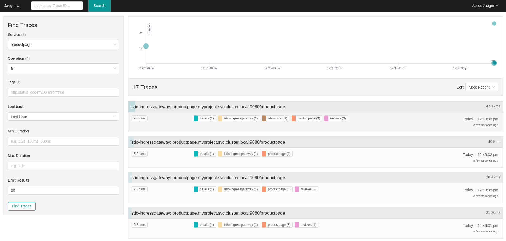
- 单击列表中的一个跟踪以打开该跟踪的详细视图。如果单击顶部（最近的）跟踪，则会看到与最新刷新对应的详细信息 `/productpage`

	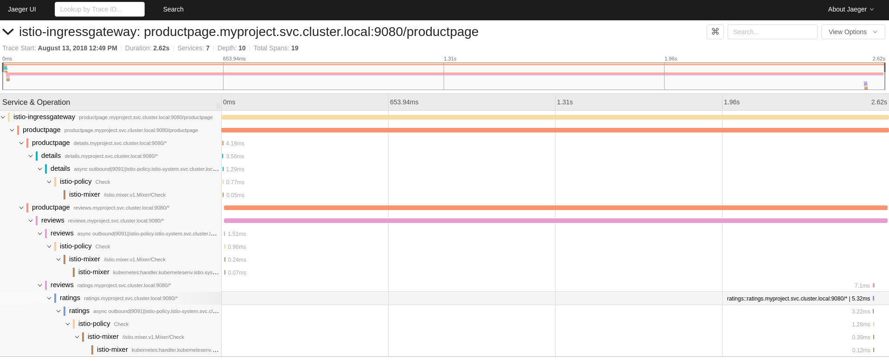
	上图中的跟踪由几个嵌套跨度组成，每个嵌套跨度对应于一个 Bookinfo 服务调用，所有这些都是为响应 `/productpage` 请求而执行的。整体处理时间为 `2.62s`，`details` 服务时间为 `3.56ms`，`reviews` 服务时间为 `2.6s`，`ratings ` 服务时间为 `5.32ms`。每个远程服务调用都由客户端和服务器端跨度表示。例如，标记了客户端跨度的 `details` 信息 `productpage details.myproject.svc.cluster.local:9080`。标记为嵌套在其下方的跨度 `details details.myproject.svc.cluster.local:9080` 对应于请求的服务器端处理。跟踪还显示对`istio-policy` 的调用，它反映了 Istio 进行的授权检查。

#### 删除跟踪教程
按照删除 Bookinfo 教程的步骤删除跟踪教程。
### 普罗米修斯教程
Prometheus 是一个开源系统和服务监控工具包。Prometheus 按指定的时间间隔从配置的目标收集指标，评估规则表达式，显示结果，并且如果观察到某些条件为真，则可以触发警报。Grafana 或其他 API 使用者可用于可视化收集的数据。

本教程使用 Service Mesh 和 bookinfo 教程演示如何使用 Prometheus 查询指标。

先决条件：

- 安装了 OpenShift Container Platform 3.11 或更高版本。
- 安装 Red Hat OpenShift Service Mesh 0.8.TechPreview。
- Bookinfo 安装演示应用程序

#### 查询指标
- 验证 prometheus 服务是否在群集中运行。执行以下命令 

		$ oc get svc prometheus -n istio-system
	
		NAME         CLUSTER-IP     EXTERNAL-IP   PORT(S)    AGE
		prometheus   10.59.241.54   <none>        9090/TCP   2m
- 通过访问 Bookinfo 应用程序生成网络流量		

		$ curl -o /dev/null http://$GATEWAY_URL/productpage
- 已存在访问 Prometheus 用户界面的路径。查询路线的详细信息

		$ export PROMETHEUS_URL=$(oc get route -n istio-system prometheus -o jsonpath='{.spec.host}')
- 启动浏览器并导航到 `http://${PROMETHEUS_URL}` 。将看到 Prometheus 主屏幕，类似于下图

	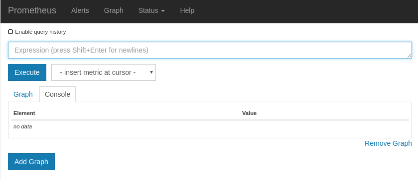 
- 在 `Expression` 字段中，输入 `istio_request_duration_seconds_count` ，然后单击 `Execute` 按钮。将看到类似于下图的屏幕

	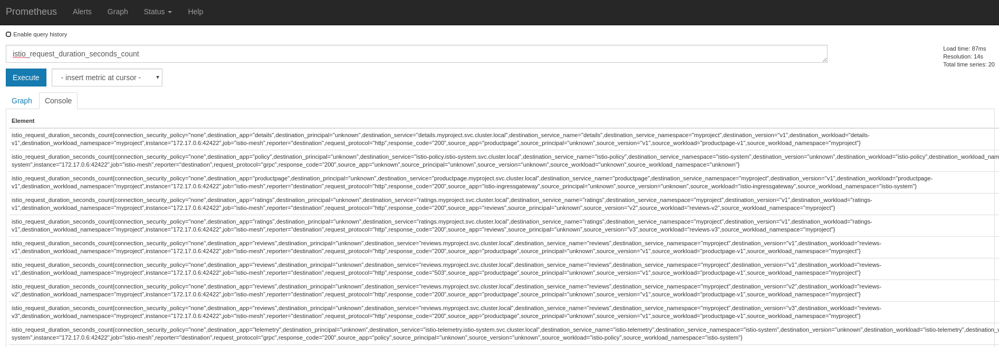 
- 可以使用选择器缩小查询范围。例如，`istio_request_duration_seconds_count{destination_workload="reviews-v2"}` 仅显示具有匹配的 `destination_workload` 标签的计数器。有关使用查询的更多信息，请参阅[Prometheus文档](https://prometheus.io/docs/prometheus/latest/querying/basics/#instant-vector-selectors)。
- 要列出所有可用的Prometheus指标，请运行以下命令

		$ oc get prometheus -n istio-system -o jsonpath='{.items[*].spec.metrics[*].name}' requests_total request_duration_seconds request_bytes response_bytes tcp_sent_bytes_total tcp_received_bytes_total

	注意，返回的指标名称必须预先考虑 `istio_` 在查询中使用时，例如， `requests_total` 是 `istio_requests_total`。

#### 删除 PROMETHEUS 教程
按照删除 Bookinfo 教程的步骤删除 Prometheus 教程
### Kiali教程
Kiali 与 Istio 合作，可视化服务网格拓扑，以提供对断路器，请求率等功能的可视性。Kiali 提供有关不同级别的网格组件的见解，从抽象应用程序到服务和工作负载。Kiali 实时提供命名空间的交互式图形视图。它可以在所选图形节点或边缘上显示具有上下文信息和图表的多个级别（应用程序，版本，工作负载）的交互。

本教程使用 Service Mesh 和 bookinfo 教程演示如何使用 Kiali 控制台查看服务网格的地形和运行状况。

先决条件：

- 安装了 OpenShift Container Platform 3.11 或更高版本。
- 安装 Red Hat OpenShift Service Mesh 0.8.TechPreview。
- 自定义资源文件中指定的 Kiali 参数。
- Bookinfo 安装演示应用程序	
	
#### 访问KIALI控制台
1. 已存在访问 Kiali 控制台的路径。运行以下命令以获取路由和 Kiali URL：

		$ oc get routes

		NAME                   HOST/PORT                                                PATH      SERVICES               PORT              TERMINATION   WILDCARD
		grafana                grafana-istio-system.127.0.0.1.nip.io                          grafana                http                            None
		istio-ingress          istio-ingress-istio-system.127.0.0.1.nip.io                    istio-ingress          http                            None
		istio-ingressgateway   istio-ingressgateway-istio-system.127.0.0.1.nip.io             istio-ingressgateway   http                            None
		jaeger-query           jaeger-query-istio-system.127.0.0.1.nip.io                     jaeger-query           jaeger-query      edge          None
		kiali                  kiali-istio-system.127.0.0.1.nip.io                            kiali                  <all>                           None
		prometheus             prometheus-istio-system.127.0.0.1.nip.io                       prometheus             http-prometheus                 None
		tracing                tracing-istio-system.127.0.0.1.nip.io                          tracing                tracing           edge          None		
- 启动浏览器并导航到 `https://${KIALI_URL} `（在上面的输出中，这是 `kiali-istio-system.127.0.0.1.nip.io`）。应该看到 Kiali 控制台登录屏幕

	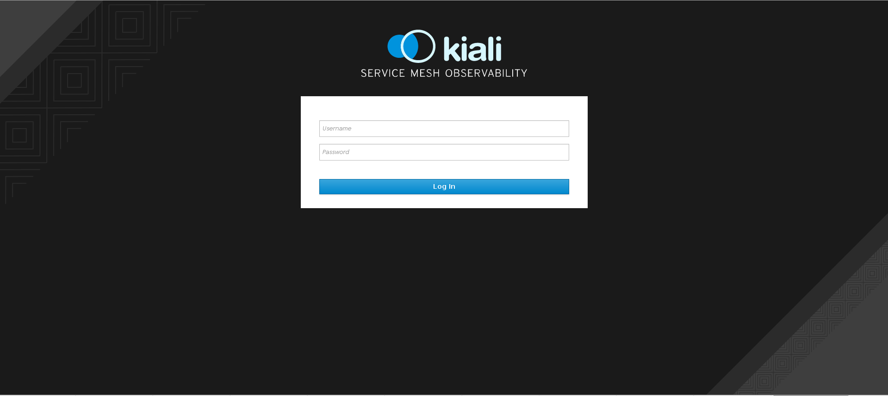
	使用在安装期间在自定义资源文件中指定的用户名和密码登录 Kiali 控制台。

#### 概述页面
登录后，将看到 “概述” 页面，该页面可让快速了解系统中各种命名空间的运行状况

#### 图形页面
1. 单击左侧导航中的“图形 ”。Graph 页面显示了一个包含所有微服务的图形，这些微服务通过它们的请求连接起来。在此页面上，可以看到服务如何相互交互	
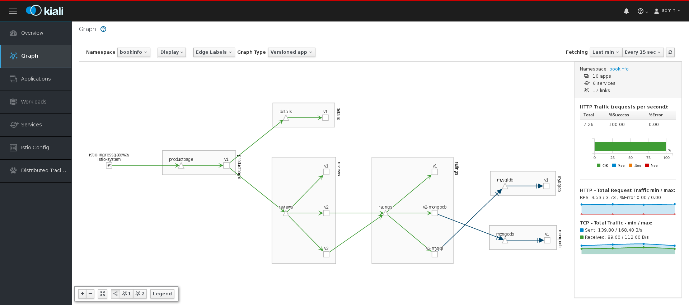
- 从 “命名空间” 菜单中选择 bookinfo。现在，图表仅显示 Bookinfo 应用程序中的服务
- 单击左下角的 “图例”。Kiali 显示一个包含图表图例的窗口

	
- 关闭图表图例
- 将鼠标悬停在产品页面节点上。请注意图表仅突出显示来自节点的传入和传出流量
- 单击 `productpage` 节点。请注意页面右侧的详细信息如何更改以显示产品页面详细信息

#### 服务页面
1. 单击左侧导航中的 “服务” 链接。在“服务”页面上，可以查看群集中正在运行的所有服务的列表以及有关它们的其他信息，例如运行状况和请求错误率。
- 将鼠标悬停在任何服务的运行状况图标上，以查看有关该服务的运行状况信息。当一个服务在线并且没有错误地响应请求时，它被认为是健康的。

	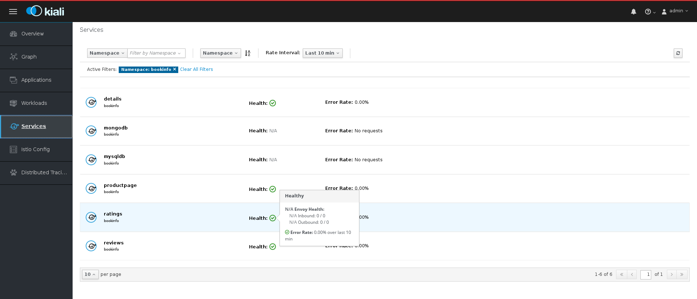
- 单击评论服务以查看其详细信息。请注意，此服务有三种不同的版本
	
	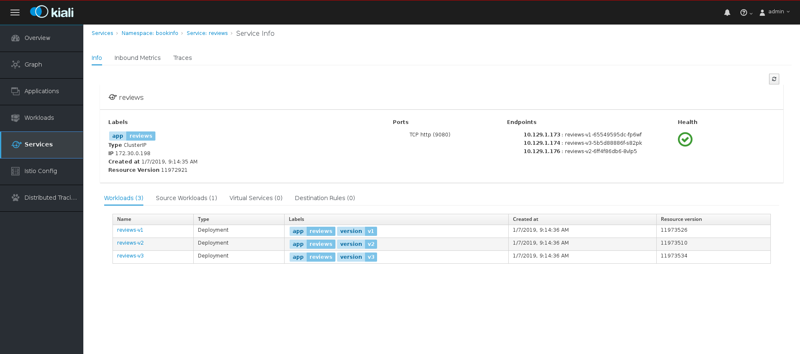
- 单击其中一个服务的名称以查看有关该服务的其他详细信息

#### ISTIO配置页面
- 单击左侧导航中的 `Istio Config` 链接。在此页面上，可以看到所有当前运行的配置，例如断路器，目标规则，故障注入，网关，路由，路由规则和虚拟服务。

	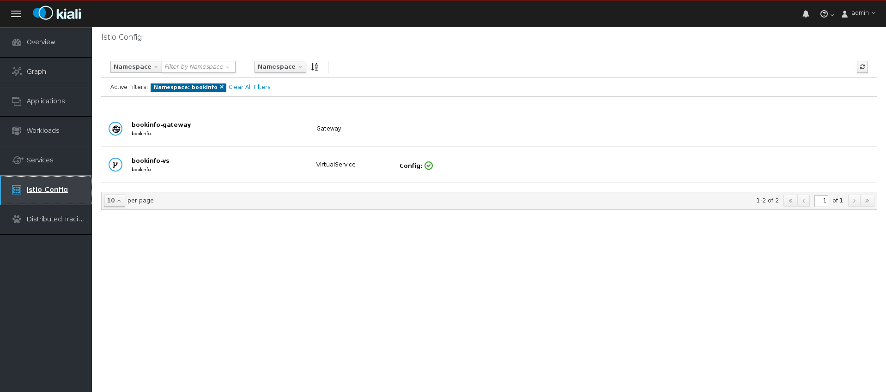
- 单击其中一个配置以查看其他信息

	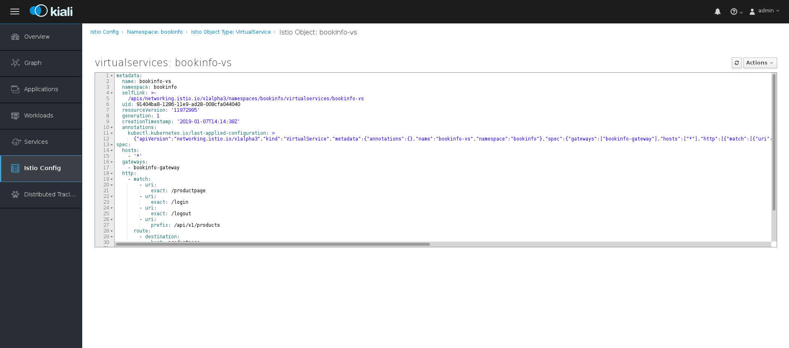

#### 分布式跟踪页面
单击左侧导航中的 `Distributed Tracing` 链接。在此页面上，可以看到 Jaeger 提供的跟踪数据。
#### 删除KIALI教程
删除 Kiali 教程的过程与删除 Bookinfo 教程相同。

### 访问GRAFANA仪表板
1. 已存在访问 Grafana 仪表板的路径。查询路线的详细信息：

		$ export GRAFANA_URL=$(oc get route -n istio-system grafana -o jsonpath='{.spec.host}')
- 启动浏览器并导航以导航到 `http://${GRAFANA_URL}` 。可以看到 Grafana 的主屏幕，如下图所示

		
- 从左上角的菜单中，选择 `Istio Mesh Dashboard` 以查看Istio网格度量标准

	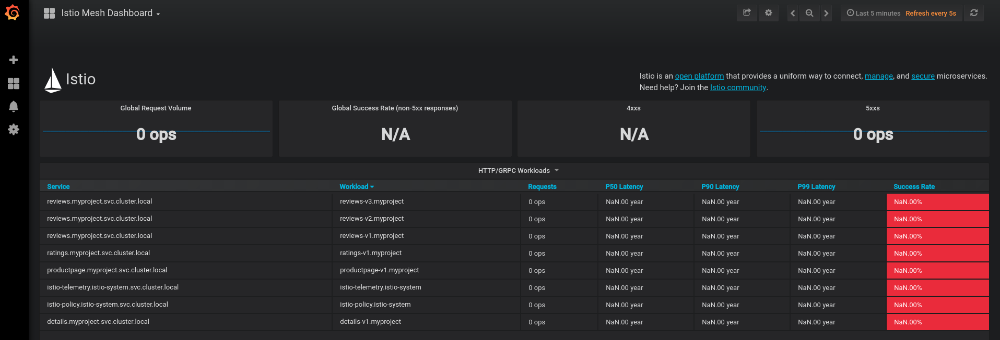
- 通过访问 Bookinfo 应用程序生成一些流量

		$ curl -o /dev/null http://$GATEWAY_URL/productpage
	仪表板反映了通过网格的流量，类似于下图	
	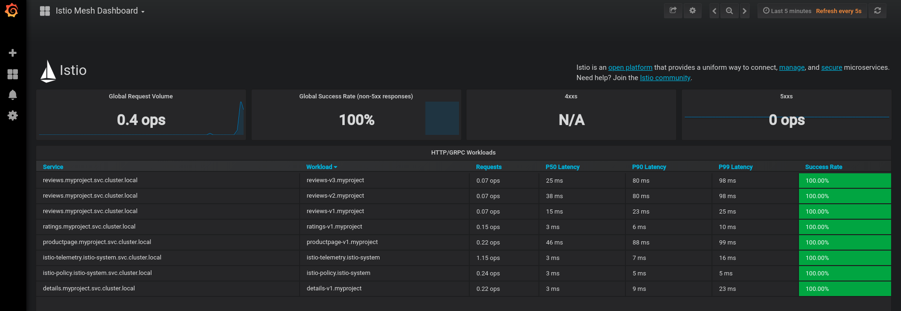
- 要查看服务的详细指标，请单击 “服务” 列中的服务名称。服务仪表板类似于下图								
	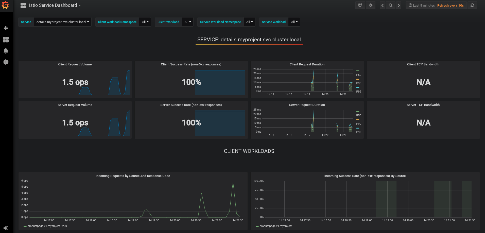
	请注意，`TCP Bandwidth` 度量标准为空，因为 Bookinfo 仅使用基于 http 的服务。仪表板还显示调用  `Client Workloads` 服务的工作负载以及处理来自 `Service Workloads` 的请求的工作负载的度量标准。可以使用仪表板顶部的菜单切换到不同的服务或按客户端和服务工作负载过滤指标。
- 要切换到工作负载仪表板，请单击左上角菜单上的 `Istio Workload Dashboard`。将看到类似下图的屏幕					
	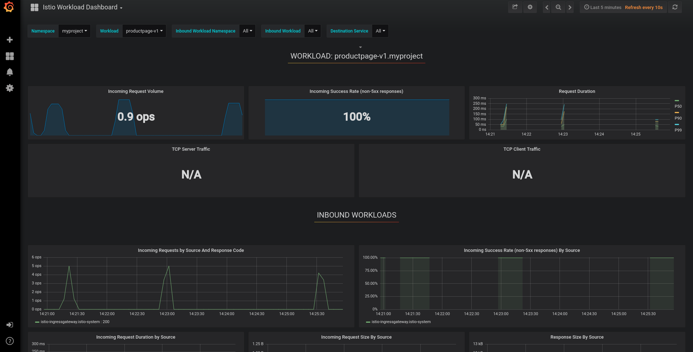						 					        	
#### 删除 GRAFANA 教程
按照删除 Bookinfo 教程的步骤删除 Grafana 教程
## Red Hat OpenShift 应用程序运行时任务
除了 bookinfo 基础教程之外，还有四个 Service Mesh 特定的教程（任务）和示例应用程序（助推器），可以使用 Fabric8 集成开发平台启动器来探索一些 Istio 功能。这些增强器和任务中的每一个都可用于四种不同的应用程序运行时。有关 Fabric8 的更多信息，请参阅[Fabric8文档](https://launcher.fabric8.io/docs/)。

先决条件：

- 安装了OpenShift Container Catalog 3.11或更高版本。
- 安装Red Hat OpenShift Service Mesh 0.8.TechPreview。
- 自定义资源文件中指定的启动器参数。

RHOAR 参数

运行|任务|描述
---|---|--- 
Springboot| [Istio断路器任务](https://github.com/snowdrop/spring-boot-istio-circuit-breaker-booster/blob/master/README.adoc)|此场景展示了如何使用 Istio 实现 Circuit Breaker 架构模式
Springboot|[Istio分布式追踪任务](https://github.com/snowdrop/spring-boot-istio-distributed-tracing-booster/blob/master/README.adoc)|此方案展示了 Jaeger 的分布式跟踪功能与在 Service Mesh 中运行的正确检测的微服务之间的交互。
Springboot|[安全任务](https://github.com/snowdrop/spring-boot-istio-security-booster/blob/master/README.adoc)|此方案展示了 Istio 安全性概念，即服务访问由平台控制，而不是由组成应用程序独立控制。
Springboot|[路由任务](https://github.com/snowdrop/spring-boot-istio-routing-booster/blob/master/README.adoc)|此方案展示了使用 Istio 的动态流量路由功能和一组示例应用程序，这些应用程序旨在模拟真实的部署方案。
Thorntail（AKA Wildfly Swarm）|[Istio断路器任务](https://github.com/wildfly-swarm-openshiftio-boosters/wfswarm-istio-circuit-breaker)|此场景展示了如何使用Istio实现Circuit Breaker架构模式。
Thorntail |[Istio分布式追踪任务](https://github.com/wildfly-swarm-openshiftio-boosters/wfswarm-istio-tracing)|此方案展示了 Jaeger 的分布式跟踪功能与在 Service Mesh 中运行的正确检测的微服务之间的交互
Thorntail |[安全任务](https://github.com/wildfly-swarm-openshiftio-boosters/wfswarm-istio-security)|此方案展示了Istio安全性概念，即服务访问由平台控制，而不是由组成应用程序独立控制。
Thorntail |[路由任务](https://github.com/wildfly-swarm-openshiftio-boosters/wfswarm-istio-routing)|此方案展示了使用Istio的动态流量路由功能和一组示例应用程序，这些应用程序旨在模拟真实的部署方案
Vert.x|[Istio断路器任务](https://github.com/openshiftio-vertx-boosters/vertx-istio-circuit-breaker-booster)|此场景展示了如何通过（最低限度）检测的Eclipse Vert.x微服务使用Istio来实现Circuit Breaker
Vert.x|[Istio分布式追踪任务](https://github.com/openshiftio-vertx-boosters/vertx-istio-distributed-tracing-booster)|此方案展示了Jaeger的分布式跟踪功能与（最低限度）检测的Eclipse Vert.x应用程序集的交互。
Vert.x|[安全任务](https://github.com/openshiftio-vertx-boosters/vertx-istio-security-booster)|此方案通过一组Eclipse Vert.x应用程序显示Istio传输层安全性（TLS）和访问控制列表（ACL）。
Vert.x|[路由任务](https://github.com/openshiftio-vertx-boosters/vertx-istio-routing-booster)|	此方案展示了使用Istio的动态流量路由功能以及最少的示例应用程序集。
Node.js|[Istio断路器任务](https://github.com/bucharest-gold/nodejs-istio-circuit-breaker)|此场景展示了如何使用Istio在Node.js应用程序中实现Circuit Breaker体系结构模式。
Node.js|[Istio分布式追踪任务](https://github.com/bucharest-gold/nodejs-istio-tracing)|此方案展示了Jaeger的分布式跟踪功能与在Service Mesh中运行的正确检测的Node.js应用程序的交互。
Node.js|[安全任务](https://github.com/bucharest-gold/nodejs-istio-security)|此方案展示了Node.js应用程序的Istio传输层安全性（TLS）和访问控制列表（ACL）。
Node.js|[路由任务](https://github.com/bucharest-gold/nodejs-istio-routing)|此方案展示了使用Istio的动态流量路由功能和一组示例应用程序，这些应用程序旨在模拟真实的部署方案。

### 删除 Red Hat OpenShift 服务网格
#### 删除 Red Hat OpenShift 服务网格
以下命令从现有安装中删除 Service Mesh。以集群管理员身份登录，并从可以访问集群的任何主机上运行这些命令。

1. 通过运行以下命令删除自定义资源

		$ oc delete -n istio-operator installation istio-installation
- 通过运行以下命令删除 operator

		$ oc process -f istio_product_operator_template.yaml | oc delete -f -

### 升级Red Hat OpenShift服务网格
暂时不支持升级
### 3scale Istio适配器
3scale Istio Adapter 允许标记在 Red Hat OpenShift Service Mesh 中运行的服务，并将该服务与 3scale API Management 解决方案集成。

先决条件：

- Red Hat OpenShift Service Mesh 0.7.0+
- 一个工作的 3scale 帐户（[SaaS](https://www.3scale.net/signup/) 或[内部部署](https://access.redhat.com/documentation/en-us/red_hat_3scale_api_management/2.4/html/infrastructure/onpremises-installation)）
- Red Hat OpenShift Service Mesh 先决条件

#### 将适配器与 RED HAT OPENSHIFT SERVICE MESH 集成
可以使用这些示例使用 3scale Istio Adapter 配置对服务的请求。

	特别注意 kind: handler 资源。必须使用 3scale 凭据和要管理的 API 的服务 ID 来更新它。

使用 3scale 配置修改处理程序配置。

适用于 3scale 处理配置

	apiVersion: "config.istio.io/v1alpha2"
	kind: handler
	metadata:
	  name: threescale
	  namespace: istio-system
	spec:
	  adapter: threescale
	  params:
	    service_id: "123456"
	    system_url: "http://127.0.0.1:8090"
	    access_token: "secret-token"
	  connection:
	    address: "threescale-istio-adapter:3333"
模板授权的实例

	apiVersion: "config.istio.io/v1alpha2"
	kind: instance
	metadata:
	  name: threescale-authorization
	  namespace: istio-system
	spec:
	  template: threescale-authorization
	  params:
	    action:
	      path: request.path | "/"
	      method: request.method | "get"	
规则派遣到 threescale 处理程序

	apiVersion: "config.istio.io/v1alpha2"
	kind: rule
	metadata:
	  name: threescale
	  namespace: istio-system
	spec:
	  match: destination.labels["service-mesh.3scale.net"] == "true"
	  actions:
	  - handler: threescale.handler.istio-system
	    instances:
	    - threescale-authorization
#### 通过适配器路由服务流量
要通过3 scale 适配器为服务提供流量，需要在 kind：rule 资源中匹配先前在配置中创建的 `destination.labels["service-mesh.3scale.net"] == "true"`  规则。

必须在目标工作负载的部署上向 PodTemplateSpec 添加标签。例如，在 `productpage` Pod 由 `productpage-v1` 部署管理的服务中，在`spec.template.labelsin` 下添加上述标签，`productpage-v1` 以使适配器授权对此服务的请求。
### 在 3scale 中配置集成设置
对于 3scale SaaS 客户，Red Hat OpenShift Service Mesh 作为 Early Access 计划的一部分启用。
#### 为本地客户启用服务网关
1. 执行以下命令以在 3scale 中启用服务网格。

		$ oc project <3scale-project>
		$ oc edit configmap system	
- 编辑 `rolling_updates.yml` 文件以添加正确的值 `service_mesh_integration`

	    production:
	    old_charts: false
	    new_provider_documentation: false
	    proxy_pro: false
	    instant_bill_plan_change: false
	    service_permissions: true
	    async_apicast_deploy: false
	    duplicate_application_id: true
	    duplicate_user_key: true
	    plan_changes_wizard: false
	    require_cc_on_signup: false
	    apicast_per_service: true
	    new_notification_system: true
	    cms_api: false
	    apicast_v2: true
	    forum: false
	    published_service_plan_signup: true
	    apicast_oidc: true
	    policies: true
	    proxy_private_base_path: true
	    service_mesh_integration: true	
- 运行以下命令

		restart system-app, system-sidekiq pods

#### 集成设置
1. 导航到 `[your_API_name]> Integration> Configuration`。
2. 在 “Integration” 页面的顶部，单击右上角的 `edit integration settings`。
3. 在 Service Mesh 标题下，单击 Istio 选项。
4. 滚动到页面底部，然后单击 `Update Service`。

### 缓存行为
默认情况下，3scale System API 的响应将在适配器中缓存。当条目变得 `cacheTTLSeconds` 比值大时，将从缓存中清除条目。此外，默认情况下，将根据 `cacheRefreshSeconds` 值在帐户到期前几秒尝试自动刷新缓存的条目。通过将此值设置为高于该值，可以禁用自动刷新 `cacheTTLSeconds`。

可以通过设置 `cacheEntriesMax` 为非正值来完全禁用缓存。

通过使用刷新过程，将在超过其到期时最终被清除之前重试其主机变得无法访问的缓存值。
### 验证请求
此技术预览版支持以下身份验证方法：

-  `Standard API Keys`：单个随机字符串或哈希，用作标识符和密钥令牌。
-  `Application identifier and key pairs`：不可变标识符和可变密钥字符串。

#### 应用身份验证模式
修改 `instance` 自定义资源（如以下身份验证方法示例中所示）以配置身份验证行为。可以接受以下身份验证凭据：

- 请求标头
- 请求参数
- 请求标头
- 查询参数

#### API 密钥身份验证方法
Service Mesh 在查询参数中查找 API 密钥，并 `user` 在 `subject` 自定义资源参数中的选项中指定请求标头。它按自定义资源文件中给出的顺序检查值。可以通过省略不需要的选项来限制搜索 API 密钥以查询参数或请求标头。

在此示例中，Service Mesh 在 `user_key` 查询参数中查找 API 密钥。如果 API 密钥不在查询参数中，则 Service Mesh 会检查 `x-user-key` 标头			

	apiVersion: "config.istio.io/v1alpha2"
	kind: instance
	metadata:
	  name: threescale-authorization
	  namespace: istio-system
	spec:
	  template: authorization
	  params:
	    subject:
	      user: request.query_params["user_key"] | request.headers["x-user-key"] | ""
	    action:
	      path: request.url_path
	      method: request.method | "get"    
如果希望适配器检查其他查询参数或请求标头，请根据需要更改名称。例如，要在名为“key”的查询参数中检查API密钥，请更改 `request.query_params["user_key"]` 为 `request.query_params["key"]`。
#### 应用程序ID和应用程序密钥对验证方法
Service Mesh 在查询参数和请求标头中查找应用程序 ID 和应用程序密钥，如自定义资源参数中的 `properties` 选项所指定 `subject`。应用程序密钥是可选的。它按自定义资源文件中给出的顺序检查值。可以通过不包含不需要的选项来限制搜索凭据以查询参数或请求标头。

在此示例中，Service Mesh 首先在查询参数中查找应用程序 ID 和应用程序密钥，然后根据需要转到请求标头。

	apiVersion: "config.istio.io/v1alpha2"
	kind: instance
	metadata:
	  name: threescale-authorization
	  namespace: istio-system
	spec:
	  template: authorization
	  params:
	    subject:
	        app_id: request.query_params["app_id"] | request.headers["x-app-id"] | ""
	        app_key: request.query_params["app_key"] | request.headers["x-app-key"] | ""
	    action:
	      path: request.url_path
	      method: request.method | "get"
如果希望适配器检查其他查询参数或请求标头，请根据需要更改名称。例如，要在名为 `identification` 的查询参数中检查应用程序ID，请更改`request.query_params["app_id"]` 为 `request.query_params["identification"]`。
#### 混合认证方法
可以选择不强制执行特定的身份验证方法，并接受任一方法的任何有效凭据。如果同时提供了 API 密钥和应用程序ID、应用程序密钥对，Service Mesh 将使用 API ​​密钥。

在此示例中，Service Mesh 检查查询参数中的 API 密钥，然后检查请求标头。如果没有 API 密钥，则它会检查应用程序 ID 并在查询参数中键入，然后检查请求标头。

	apiVersion: "config.istio.io/v1alpha2"
	kind: instance
	metadata:
	  name: threescale-authorization
	  namespace: istio-system
	spec:
	  template: authorization
	  params:
	    subject:
	      user: request.query_params["user_key"] | request.headers["x-user-key"] | request.api_key | ""
	      properties:
	        app_id: request.query_params["app_id"] | request.headers["x-app-id"] | ""
	        app_key: request.query_params["app_key"] | request.headers["x-app-key"] | ""
	    action:
	      path: request.url_path
	      method: request.method | "get"
### 适配器指标
默认情况下，适配器会报告端点上端口 8080 上公开的各种 Prometheus 指标 `/metrics`。这些指标可以让您深入了解适配器和 3scale 之间的交互是如何执行的。该服务标记为由 Prometheus 自动发现和删除。

	      	          

  
		      		      
