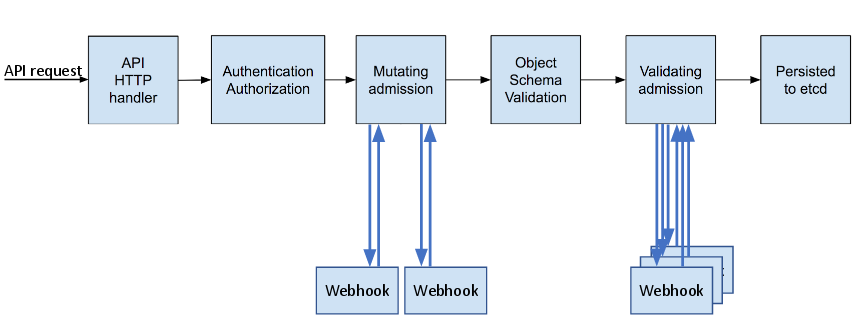

# 自定义准入控制器
## 概观
除了默认的[准入控制器](https://docs.okd.io/3.11/architecture/additional_concepts/admission_controllers.html#architecture-additional-concepts-admission-controllers)之外，还可以使用准入 webhook 作为准入链的一部分。

准入 webhooks 调用 webhook 服务器在创建时改变 pod，例如注入标签或在准入过程中验证 pod 配置的特定方面。

准入 webhooks 在资源请求经过身份验证和授权之后和持久化之前拦截对 master API 的请求。
## 准入 Webhooks
在OKD中，可以使用在 API 准入链中调用 webhook 服务器的准入 webhook 对象。

可以配置两种类型的准入 webhook 对象：

- [Mutating admission webhooks](https://docs.okd.io/3.11/architecture/additional_concepts/dynamic_admission_controllers.html#admission-webhooks-m)允许使用 Mutating webhook 来修改资源内容，然后再保留它。

- [Validating admission webhooks](https://docs.okd.io/3.11/architecture/additional_concepts/dynamic_admission_controllers.html#admission-webhooks-v)允许使用 Validating webhook 来强制执行自定义准入策略。

配置 webhook 和外部 webhook 服务器超出了本文档的范围。但是，webhook 必须遵循[接口](https://github.com/kubernetes/kubernetes/blob/v1.10.0-beta.1/staging/src/k8s.io/api/admission/v1beta1/types.go#L28)才能与OKD一起正常工作。

	准入 webhooks 仅限技术预览功能。

实例化对象时，OKD 进行 API 调用以接纳该对象。在准入过程中，mutating 准入控制器可以调用 webhook 来执行任务，例如注入亲和标签。在修改过程结束时，validating 准入控制器可以调用 webhook 以确保正确配置对象，例如验证关联标签。如果验证通过，则 OKD 按配置调度对象。

当 API 请求进入时，mutating 或 validating 准入控制器使用配置中的外部 webhook 列表并行调用它们：

- 如果所有 webhook 都批准了请求，则准入链继续。
- 如果任何 webhook 拒绝请求，则拒绝接纳请求，并且这样做的原因是基于第一个 webhook 拒绝原因。
- 如果多个 webhook 拒绝接纳请求，则只有第一个将返回给用户。
- 如果在调用 webhook 时遇到错误，则忽略该请求，并用于批准/拒绝准入请求。

准入控制器和 webhook 服务器之间的通信需要使用 TLS 进行保护。生成 CA 证书并使用该证书对 Webhook 服务器使用的服务器证书进行签名。PEM 格式的 CA 证书使用诸如 [Service Serving Certificate Secrets](https://docs.okd.io/3.11/dev_guide/secrets.html#service-serving-certificate-secrets) 之类的机制提供给准入控制器 。

下图说明了此过程，其中包含两个调用多个 webhook 的准入 webhook。

准入 webhooks 的一个简单示例用例是资源的语法验证。例如，您的基础结构要求所有 pod 都有一组通用标签，如果 pod 没有这些标签，则不希望任何 pod 保留。您可以编写一个 webhook 来注入这些标签，另一个 webhook 可以验证标签是否存在。然后，OKD 将安排具有标签的 pod 并通过验证并拒绝缺少标签的pod。

一些常见的用例包括：

- 调整资源以将边车容器注入 pod。
- 限制项目以阻止项目中的某些资源。
- 自定义资源验证，以对依赖字段执行复杂验证。

## 准入 Webhooks 的类型
群集管理员可以在 API 服务器的准入链中包括变更准入 webhook 或验证准入 webhook。

在准入过程的 Mutating 阶段期间调用 Mutating 准入 webhook，这允许在持久化之前修改资源内容。Mutating 录入 webhook 的一个示例是 [Pod Node Selector](https://docs.okd.io/3.11/admin_guide/scheduling/pod_placement.html#constraining-pod-placement-nodeselector) 功能，它使用命名空间上的注释来查找标签选择器并将其添加到 pod 规范中。

	apiVersion: admissionregistration.k8s.io/v1beta1
	  kind: MutatingWebhookConfiguration  #制定 mutating webhook 配置
	  metadata:
	    name: <controller_name> # 注册 webhook 对象名
	  webhooks:
	  - name: <webhook_name>  #要调用的 webhook 的名称
	    clientConfig:  # 有关如何连接、发送、信任 webhook 服务器数据的信息
	      service:
	        namespace:  # 创建前端服务的项目
	        name: # 服务名
	       path: <webhook_url> # 用于准入请求的 webhook url
	      caBundle: <cert>  # 服务器证书
	    rules: #定义 api 服务器什么时候触发控制器规则
	    - operations: #触发 api 服务器调用此控制器的操作，如创建、更新、删除、连接
	      - <operation>
	      apiGroups:
	      - ""
	      apiVersions:
	      - "*"
	      resources:
	      - <resource>
	    failurePolicy: <policy> #制定如果 webhook 不可用，执行什么策略。分为 Ignore (allow/fail open) 或者 Fail (block/fail closed). 
	    
注意：Fail open 可能会导致客户端出现不可预测行为

在准入过程的验证阶段期间调用验证准入 webhook。此阶段允许在特定 API 资源上强制执行且不会在改变，以确保资源不会再次更改。`nodeSelector` 也是验证许可的一个示例，通过确保所有 `nodeSelector` 字段都受项目的节点选择器限制约束。

	apiVersion: admissionregistration.k8s.io/v1beta1
	  kind: ValidatingWebhookConfiguration 
	  metadata:
	    name: <controller_name> 
	  webhooks:
	  - name: <webhook_name> 
	    clientConfig: 
	      service:
	        namespace: default  
	        name: kubernetes 
	       path: <webhook_url> 
	      caBundle: <cert> 
	    rules: 
	    - operations: 
	      - <operation>
	      apiGroups:
	      - ""
	      apiVersions:
	      - "*"
	      resources:
	      - <resource>
	    failurePolicy: <policy> 

## 创建Admission Webhook
首先部署外部 webhook 服务器并确保其正常工作。否则，根据 webhook 是否配置为 `fail open` 或 `fail closed`，将无条件接受或拒绝操作。

1. 在YAML文件中配置[mutating](https://docs.okd.io/3.11/architecture/additional_concepts/dynamic_admission_controllers.html#architecture-additional-concepts-dynamic-admission-webhooks-ex-m)或[validating](https://docs.okd.io/3.11/architecture/additional_concepts/dynamic_admission_controllers.html#architecture-additional-concepts-dynamic-admission-webhooks-ex-v)准入 webhook 对象。
- 运行以下命令以创建对象,创建准入 webhook 对象后，OKD需要几秒钟来加载新配置。

		oc create -f <file-name>.yaml
- 为准入 webhook 创建前端服务

		apiVersion: v1
		kind: Service
		metadata:
		  labels:
		    role: webhook #用于触发 webhook 的标签
		  name: <name>
		spec:
		  selector:
		   role: webhook #用于触发 webhook 的标签
- 运行以下命令以创建对象

		oc create -f <文件名> .yaml
- 将准入 webhook 名称添加到希望由 webhook 控制的 pod 中

		apiVersion: v1
		kind: Pod
		metadata:
		  labels:
		    role: webhook #用于触发webhook的标签
		  name: <name>
		spec:
		  containers:
		    - name: <name>
		      image: myrepo/myimage:latest
		      imagePullPolicy: <policy>
		      ports:
		       - containerPort: 8000	

请参阅[kubernetes-namespace-reservation](https://github.com/openshift/kubernetes-namespace-reservation)项目 ，了解如何为库构建自己的安全 webhook 准入服务器和 [generic-admission-apiserver](https://github.com/openshift/generic-admission-server)的端到端示例。			   
 
## 准入 webhook 例子
以下是一个准入webhook的例子，[如果保留名称空间](https://github.com/openshift/kubernetes-namespace-reservation)，则不允许[创建名称空间](https://github.com/openshift/kubernetes-namespace-reservation)：

	apiVersion: admissionregistration.k8s.io/v1beta1
	  kind: ValidatingWebhookConfiguration
	  metadata:
	    name: namespacereservations.admission.online.openshift.io
	  webhooks:
	  - name: namespacereservations.admission.online.openshift.io
	    clientConfig:
	      service:
	        namespace: default
	        name: webhooks
	       path: /apis/admission.online.openshift.io/v1beta1/namespacereservations
	      caBundle: KUBE_CA_HERE
	    rules:
	    - operations:
	      - CREATE
	      apiGroups:
	      - ""
	      apiVersions:
	      - "b1"
	      resources:
	      - namespaces
	    failurePolicy: Ignore
以下是将由名为 webhook 的准入 webhook 评估的 pod 示例：

	apiVersion: v1
	kind: Pod
	metadata:
	  labels:
	    role: webhook
	  name: webhook
	spec:
	  containers:
	    - name: webhook
	      image: myrepo/myimage:latest
	      imagePullPolicy: IfNotPresent
	      ports:
	- containerPort: 8000
以下是 webhook 的前端服务：

	apiVersion: v1
	kind: Service
	metadata:
	  labels:
	    role: webhook
	  name: webhook
	spec:
	  ports:
	    - port: 443
	      targetPort: 8000
	  selector:
	role: webhook

