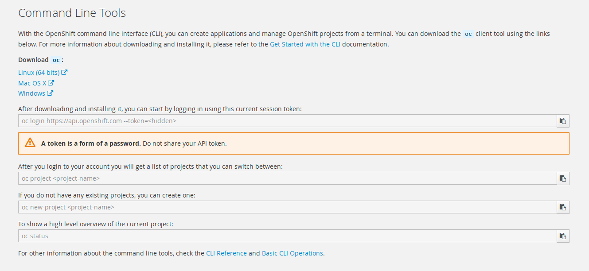
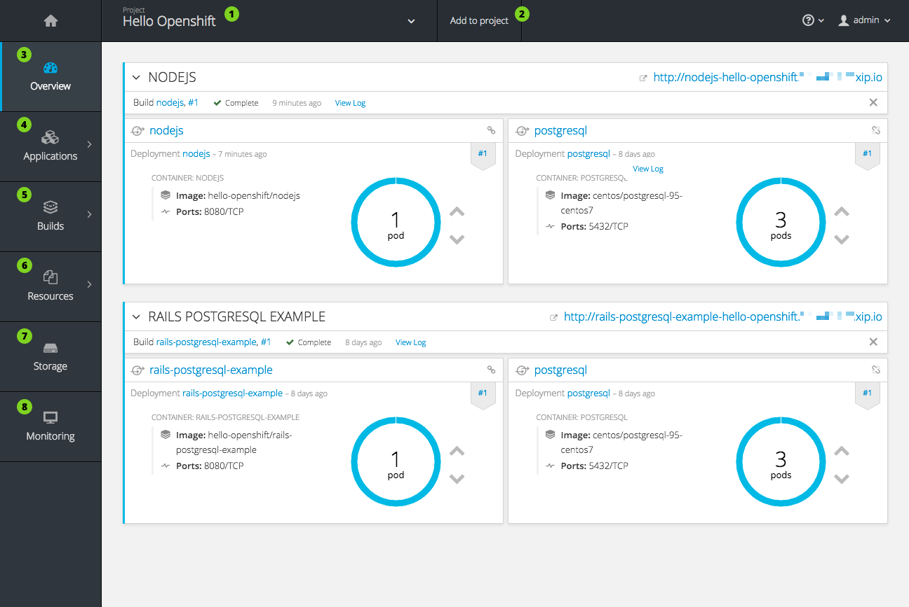
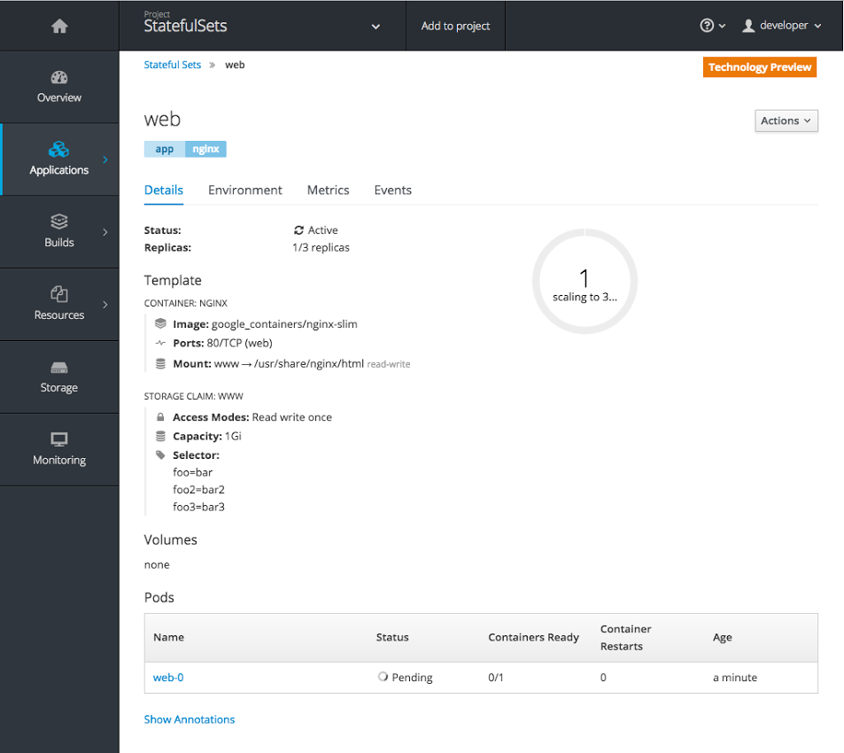

# 基础架构组件
## k8s 基础设施
k8s 集群由一个或多个主节点和一组计算节点组成。可以选择主节点高可用以确保没有单点故障。 opc 3.6 版本使用的是 k8s 1.6 和 docker 1.12.6 版本。注意 opc 小版本同步 k8s 小版本。

- 主管理节点 (master)

	主管理节点是主机或者包含 master 组件的主机。包含 api 服务器，控制管理服务器和 etcd。主管理节点管理 k8s 中的其他节点，并调度 pod 在这些节点上运行。

	- api 服务

		k8s api 服务器验证并配置了 pod, 服务(service), 复制控制器(rc)。还将 pod 分配给节点，并将 pod 分配给节点并将配 pod 信息与服务配置同步。可以作为独立进程运行。
	- etcd

		etcd 持需存储 master 的状态，而其他组件将监视 etcd 更改的信息以使其进入所需的状态。etcd 通常部署 2n+1 对等服务来做高可用。
	- 控制管理服务

		控制管理服务器通过监视 etcd 来修改复制控制器对象，然后使用 api 强制执行所需的状态。可以独立进程运行。可能会有几个相同的控制管理服务在一个集群，但同时只有一个 leader 工作。
	- haproxy

		可选的，高可用时使用，通过这个方法来给 api 服务做负载均衡。高级安装可以使用原生的方案配置 haproxy，或者也可以设置预先定义好的负载均衡替换该方案。
- 高可用 master

	单 master 配置无法保证整体集群高可用，降低了应用故障和新建应用的能力。可以选择高可用部署来解决。建议两种模式:
	
	- 通过建立 runbook 来重建 master 节点，这个方案仅仅是控制运行 runbook 的频率。例如 master 节点冷备份可以充分满足 sla。sla 不需要在几分钟内恢复服务。
	- 使用高可用解决方案来配置 master 节点，并确保集群没有单点故障。高级安装提供使用原生 ha 和配置 haproxy 的具体例。

	- 使用 haproxy 的ha 方案时，master 组件具有以下可用行
		- etcd
			- 状态:主动-主动
			- 冗余部署并自带负载均衡
		- api server
			- 状态:主动-主动
			- 由 haproxy 负责			
		- 控制管理服务器
			- 状态:主动-被动
			- leader 工作
		- haproxy
			- 状态:主动-被动
			- 负载均衡 api 服务
- 计算节点(node)

	计算节点为容器提供运行时环境。k8s 集群中的每个计算节点都要由主节点管理所需服务。计算节点还具有运行 pod 的所有服务，包括 docker,kubelet和一个代理服务。 opc 支持从物理、云、虚拟机环境创建节点。主节点使用的计算节点对象信息时来自验证过健康检查的计算节点。健康检查失败将会使一个节点被忽略，直到它通过运行状况检查。

管理员可以使用 ocp 的 cli 来[管理计算节点](https://docs.openshift.com/container-platform/3.6/admin_guide/manage_nodes.html#admin-guide-manage-nodes)。要启动计算节点服务器时定义完整的配置和安全选项，请使用[专用计算节点配置文件](https://docs.openshift.com/container-platform/3.6/install_config/master_node_configuration.html#install-config-master-node-configuration)。

```
opc 推荐最大的节点数为 300
```

- kubelet
	
	每个计算节点都有一个 kubelet 来更新容器清单，该容器清单是描述一个 pod 的 yaml 文件。 kubelet 使用一组清单来确保其容器启动并持续运行。可以通过以下方式向 kubelet 提供清单:
	
	- 每20秒会检查一下命令行上的文件路径
	- 用命令行通过 http 端点传递，每20秒检查一次。
	- kubelet 观察一个 etcd 服务器，例如 `/registry/hosts/$(hostname -f)`，并对任何更改进行操作。
	- kubelet 监听 http 和响应 api 提交的一个简单的新清单。 
- 服务代理

	每个计算节点还运行一个简单的网络代理，以反映该节点上的 api 中定义的服务。这允许计算节点在一组后端执行简单的 tcp 和 udp 流转发。
- 节点对象定义

	以下是对一个计算节点对象的定义

	```	
apiVersion: v1 # 定义 api 版本 
kind: Node #类型设置为节点类型，作为计算节点对象定义
metadata:
  creationTimestamp: null
  labels: #列出已经添加到节点的任何标签
    kubernetes.io/hostname: node1.example.com
  name: node1.example.com #定义节点对象名称，运行 oc get nodes 显示
spec:
  externalID: node1.example.com #定义可以到达计算节点的完全域名，默认为 metadata.name
status:
  nodeInfo:
    bootID: ""
    containerRuntimeVersion: ""
    kernelVersion: ""
    kubeProxyVersion: ""
    kubeletVersion: ""
    machineID: ""
    osImage: ""
    systemUUID: ""	 	
```	
	[rest api 更多细节](https://docs.openshift.com/container-platform/3.6/rest_api/kubernetes_v1.html#rest-api-kubernetes-v1)

## 镜像仓库
ocp 可以利用任何的 docker 镜像仓库服务器作为镜像源，包括 docker hub,第三方私有仓库和 ocp 集成镜像仓库。

- ocp 集成的镜像仓库

	ocp 提供了一个集成的镜像仓库，称为 ocp 镜像仓库(OCR)，它可以根据需求自动配置新的镜像仓库。这作为用户提供了内置的应用程序构建位置以推送生成的镜像。无论何时将新的镜像推送到 OCR，镜像仓库将通知 ocp 关于新镜像的信息，传递所有关于它的信息，例如命名空间，名称，镜像元数据。提供 ocp 对新镜像作出反应的能力，比如创建新的构建和部署。 OCR 也可以独立部署，无需构建和部署集成。
- 第三方镜像仓库

	ocp 可以使用来自第三方的镜像仓库，这些镜像仓库不可能提供与 ocp 集成镜像仓库相同的通知功能。这种情况下， ocp 将创建一个 imagestream 从第三方镜像仓库中功能获取标签。刷新获取标签与运行 `oc import-image <stream>` 一样简单。当检测到新镜像，会发生先前描述的构建和部署反应。
- 认证

	ocp 可以与镜像仓库通讯，以使用用户提供的凭证访问私有镜像仓库。这允许 ocp 对私有镜像仓库镜像进行各种操作，[更多描述](https://docs.openshift.com/container-platform/3.6/architecture/additional_concepts/authentication.html#architecture-additional-concepts-authentication)

## web 控制台
ocp web 控制台是可以从 web 游览器访问的用户界面。开发人员可以使用 web 控制台来显示，游览，管理项目内容。

	注意：
	游览器必须启动 js 才能使用 web 控制台。为得到最佳体验，请使用支持 websockets 的 web 游览器。
web 控制台作为 master 的一部分启动。运行 web 控制台所需的所有静态资源都由 `openshift` 二进制文件提供。管理员还可以使用扩展来[定义 web 控制台](https://docs.openshift.com/container-platform/3.6/install_config/web_console_customization.html#install-config-web-console-customization)，这样可以在 web 控制台加载运行时的脚本病家在自定义样式表。可以通过这种方式改变用户界面几乎所有方面。

游览器会首先加载所有必须的静态资源。然后使用从 `openshift start` 选项定义的值 `--public-master`或者从相关 master 配置参数 `masterPublicURL` 向 ocp api 发出请求。 web 控制台使用 websockets 来维护与 api 服务器的持久连接，并在可用时建立接收更新的信息。

配置主机名和 web 控制台的ip 地址列入白名单，以便安全访问 api 服务器，即使游览器将请求视为 [cross-origin](http://www.w3.org/TR/cors/)。使用不同的主机名从 web 应用程序访问 api 服务器，所以必须通过 `openshift start` 或相关 master 配置参数 [corsAllowedOrigins](https://docs.openshift.com/container-platform/3.6/install_config/master_node_configuration.html#master-configuration-files) 上指定 `--cors-allowed-origins` 选项将该主机列入白名单。

- cli 下载

	可以从 web 控制台的 `命令行工具` 页面下载并解压 cli，支持 linux\mac\win。集群管理员可以进一步定制这些连接。

- 游览器支持
[查看列表](https://access.redhat.com/articles/2176281)
- 页面概述

	
	
	1. 项目选择器
	2. 使用应用目录或者模版或者镜像库创建新应用
	3. 当前项目的每个组件高级可视化内容
	4. 游览部署、pod、服务、路由执行操作
	5. 游览对构建和镜像流的操作
	6. 查看当前配合和消耗
	7. 查看持久化卷的声明和应用程序请求
	8. 查看构建、 pod、部署的日志和所有对象的时间通知。
- jvm 控制台

	对于基于 java 镜像的 pod，web 控制台还可以访问基于 [hawt.io-based](http://hawt.io/)的 java 控制台，可以查看和管理任何相关的集成组件。只要容器由一个名为 `jolokia` 的端口，链接显示在 pod 的详细信息的 `Browse → Pods page`
	 
	 
	
	连接到 jvm 控制台后，会显示不同的页面，具体取决于于连接的 pod 相关的组件。
	 
	
	可用信息
	
	- jvm

		查看和管理 jvm域和 mbeans
	- threads

		查看和监控线程的状态
	- activemq

		查看和管理 activemq
	- camel

		查看和管理 camel 路由和依赖关系
	- osgi 

		查看和管理 jboss fuse osgi 环境
- StatefulSets

	`StatefulSets` 作为 ocp 3.5 版本中的预览版功能引入，并保留在技术预览版中。 `StatefulSets` 控制器为其 pod 提供唯一的身份，并确定部署和缩放顺序。 `StatefulSets` 对于唯一的网络表示，持久化，优雅部署和扩展以及优雅终止和删除是有用的。
		 		