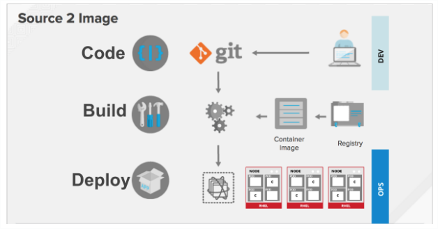
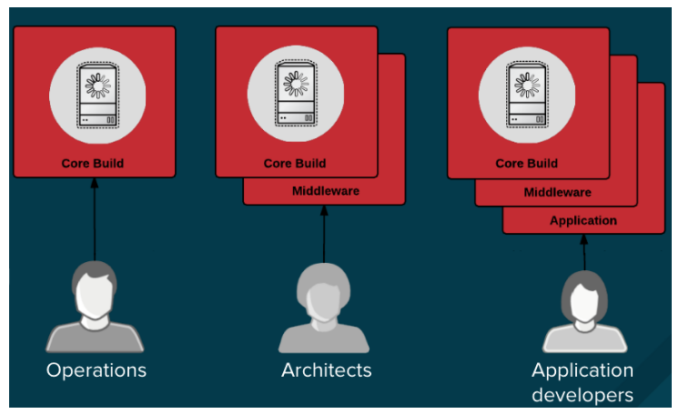

# 容器安全-构建进程
## 构建一次多次使用
在容器环境中，软件构建过程是应用程序代码与所需运行时库集成在一起的生命周期阶段。管理这个构建这个过程是保护软件堆栈的关键。

使用 ocp 作为容器构建标准平台，可以保证构建环境的安全性。坚持一次构建多次使用的理念。确保构建过程的产品正是生产部署产品。

保持容器的不变性很重要。不应该修补正在运行的容器，而是出问题重新生成并部署新版。
## 构建管理和安全
可以使用 s2i 来组合源代码和基本镜像。builder 镜像利用 s2i 使开发和运维团队能够在重复的构建环境中进行协作。

当开发人员使用 git 为使用构建镜像的应用程序提交代码时， ocp 可以执行以下功能:

- 触发，通过代码库的 webhook 或其他自动化持续集成进程，可以自动从可用的组件自动组装新的镜像, s2i 生成镜像和提交新的代码。
- 自动部署新建的镜像进行测试
- 将测试镜像推广到可以使用 ci 过程自动部署的生产环境
	

可以使用 ocp 内置镜像仓库来管理对镜像的访问。 s2i 和原生构建镜像都被自动推送到 ocp 内置镜像仓库。

除了包含 jenkins，还可以使用 restful api 将构建的 ci 环境与 ocp 集成，以及使用任何 api 兼容的镜像仓库。

ocp 开发指南建议阅读

- [如何构建工作](https://docs.openshift.org/3.6/dev_guide/builds/index.html#dev-guide-how-builds-work)
- [触发构建](https://docs.openshift.org/3.6/dev_guide/builds/triggering_builds.html#dev-guide-triggering-builds)
- [S2I 构建](https://docs.openshift.org/3.6/architecture/core_concepts/builds_and_image_streams.html#source-build)
- [其他镜像-jenkins](https://docs.openshift.org/3.6/using_images/other_images/jenkins.html#using-images-other-images-jenkins)

## 在构建过程中安全输入[详细阅读开发手册](https://docs.openshift.org/3.6/dev_guide/builds/build_inputs.html#using-secrets-during-build)
在某些情况下，构建操作需要请求凭证依赖的资源，但这些凭证在构成生成的最终应用镜像中是不可用的。可以为此定义独立的私密凭证。

例如在构建 node.js 应用程序时，可以为 node.js 模块设置私有镜像 mirror。为了从私有镜像 mirror 下载模块，必须为包含 url 的构建提供自定义的 `.npmrc` 文件,用户名，密码。出于安全原因，不希望这些在镜像中出现。使用这个场景，可以将输入密码添加到新的 `buildconfig` 中“

- 创建私有凭证(创建一个名为 `secret-npmrc` 的私有凭证，其中包含 `~/.npmrc` 文件，`base64` 编码内容

		$ oc secrets new secret-npmrc .npmrc=~/.npmrc
- 将 私有凭证添加到现有的 `buildconfig` 中的源代码部分

```
source:
  git:
    uri: https://github.com/openshift/nodejs-ex.git
  secrets:
    - secret:
        name: secret-npmrc
```

- 要将私有凭证包含在新的 `buildconfig` 中，请运行以下命令

```
$ oc new-build \
    openshift/nodejs-010-centos7~https://github.com/openshift/nodejs-ex.git \
    --build-secret secret-npmrc
```

## 设计构建过程
可以设计容器镜像管理和构建过程以使用容器镜像层，可以分离控制

例如，一个操作团队管理基础镜像，而架构师管理中间件、运行时
数据库和其他解决方案。然后开发人员可以专注于应用程序层，只需要写代码即可。

由于每天都会发现新的漏洞，因此需要主动检查容器内容。为此，应该将自动安全测试集成到 ci 流程中。例如

- SAST/DAST 静态和动态安全测试工具
- 扫描仪用于实时检查已知漏洞。类似这样的工具会对容器中的开源代码软件包进行编辑，通知任何已经知道的漏洞，并在扫描的软件包中发现新的漏洞时进行更新。

CI 过程应该包括标记为安全扫描发现问题的策略，以便团队可以采取适当的措施来解决这些问题。应该签署定制的容器，以确保在构建和部署之间不会有任何篡改。
			
		
