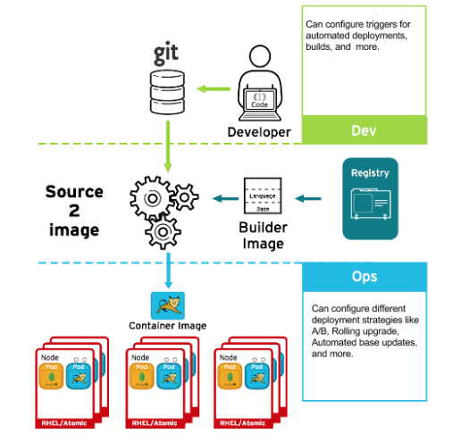

# 容器安全手册-部署
## 控制可以在容器中部署的内容
如果在构建过程中发生某些事情或者在镜像部署后发现漏洞，可以使用工具进行基于策略的自动化部署。可以使用触发器来重建和替换镜像，而不是修补正在运行的容器。

例如，使用三个容器镜像层构建应用程序:核心层、中间件层、应用程序层。核心层镜像中发现一个问题，该镜像被重建。构建完成后，镜像将被推送到 openshift 内置镜像仓库。根据定义，触发器检测到镜像已经改变，并自动重建和部署应用程序镜像。此更改合并了固定的库，并确保生产代码与最新的镜像相同。

`oc set triggers` 命令用于设置部署配置的部署触发器，例如，要在名为 `frontend` 的部署配置中设置 `ImageChangeTrigger`:

```
$ oc set triggers dc/frontend \
    --from-image=myproject/origin-ruby-sample:latest \
    -c helloworld
```
## 控制可以部署哪些镜像源
预期的镜像实际上正在被部署，它们来自可靠的来源，而且没有被改变，加密签名提供了这种保证。 openshift 集群管理员可以应用宽或者窄的安全策略，反应部署环境和安全要求。两个参数定义了这个策略：

- 一个或多个镜像仓库(带有可选的项目名称)
- 信任类型(接受，拒绝或要求公共密钥)

有了这些策略参数，镜像仓库或部分镜像仓库，即使是个个别的镜像，也可以列入白名单(接受)、黑名单(拒绝)、或者使用可信公钥来定义信任关系，以确保源被加密验证。策略规则适用于节点。策略可以统一应用于所有节点，也可以针对不同的节点工作负载(例如,构建、区域、环境)

`镜像签名策略文件`

```
{
    "default": [{"type": "reject"}],
    "transports": {
        "docker": {
            "registry.access.redhat.com": [
                {
                    "type": "signedBy",
                    "keyType": "GPGKeys",
                    "keyPath": "/etc/pki/rpm-gpg/RPM-GPG-KEY-redhat-release"
                }
            ]
        },
        "atomic": {
            "172.30.1.1:5000/openshift": [
                {
                    "type": "signedBy",
                    "keyType": "GPGKeys",
                    "keyPath": "/etc/pki/rpm-gpg/RPM-GPG-KEY-redhat-release"
                }
            ],
            "172.30.1.1:5000/production": [
                {
                    "type": "signedBy",
                    "keyType": "GPGKeys",
                    "keyPath": "/etc/pki/example.com/pubkey"
                }
            ],
            "172.30.1.1:5000": [{"type": "insecureAcceptAnything"}]
        }
    }
}
```

该策略可以在一个节点保存为 `/etc/containers/policy.json` 。

用例规则说明:

- 要求 `registry.access.redhat.com` 的镜像由 rh 提供公钥签名
- 在命名空间中的内部镜像仓库要求镜像由 rh 提供公钥签名
- 生产命名空间中的内部镜像仓库需要使用 `example.com` 的公钥签名
- 拒绝未由全局默认定义指定的所有其他镜像仓库

## 签名传输
签名传输时一种存储和检索二进制签名 blob 的方法。有两种类型的签名传输。

- atomic

	由 openshift api 管理，使用传输类型的签名由 openshift api 管理。镜像必须由内部镜像仓库存储。由 `docker/distribution` extensions API 自动发现镜像签名端点，因此不需要额外的配置。
- docker

	作为本地文件或通过一个 web 服务器。使用 docker 传输类型的签名由本地文件或 web 服务器提供。它们具有最大的灵活性:任何容器镜像仓库都可以用来为独立服务器提供镜像以提供二进制签名。但 docker 传输类型需要额外的配置。每个节点必须使用签名服务器的 uri 进行配置，默认情况下使用任意名称的 yaml 文件防止在主机系统的目录 `/etc/containers/registries.d` 中。配置文件包含镜像仓库 uri 和签名服务器 uri 或者 sigstore.
	
签名镜像仓库文件

```
docker:
    registry.access.redhat.com:
        sigstore: http://registry.access.redhat.com/content/sigstore/
```
这个示例文件可以作为 `/etc/containers/registries.d/redhat.com.yaml` 放在每个节点上。它定义了一个签名服务器 `sigstore` 参数来为 rh 镜像仓库 `access.registry.redhat.com` 提供 docker 传输类型的签名。例如,这些文件放在节点集群上可以使用 ansible 自动执行。由于策略和 `registries.d` 文件是由容器运行时动态加载的，因此不需要重新启动服务。

## 私密凭证和配置集
私密凭证对象类型提供了一种机制来保存敏感信息，如密码、openshift 客户端配置文件、dockercfg文件等。私密凭证从 pod 分离敏感内容。可以使用卷插件将它装载到容器中，或者系统可以使用它来代表 pod 执行操作。

例如，使用 web 控制台为部署配置添加一个私密凭证，以便它可以访问私有镜像仓库:

- 创建新项目
- 导航到资源 -> 私有凭证 -> 创建一个新的私有凭证。将凭证类型设置为 ` Image Secret`和身份验证类型为镜像仓库凭证来输入私有镜像仓库凭证。

创建部署配置时，将 "pull 私有凭证" 设置为新的私有凭证。

配置集类似于私有凭证，但是宗旨在支持使用不包含敏感信息的字符串。配置集对象包含可在 pod 中使用的配置数据的集 kv 对或用于存储系统组件的配置数，如控制器
## 安全上下文约束(scc)
可以使用安全上下文约束 scc  来定义一组必须接受的条件才能运行的容器。scc 可以管理的一些方面包括:

- 运行特权容器
- 容器可以请求添加的功能
- 使用主机目录作为卷
- 容器的 selinux 上下文
- 容器用户识别

如果拥有所需的权限，默认 scc  策略可以调整为宽松。

## 持续集成特权容器
可以将持续部署工具与 openshift 集成。通过利用 cicd 和 openshift ，可以自动执行重建应用程序的过程，以整合最新的修复程序，进行测试，并确保其部署到环境中的任何地方。
