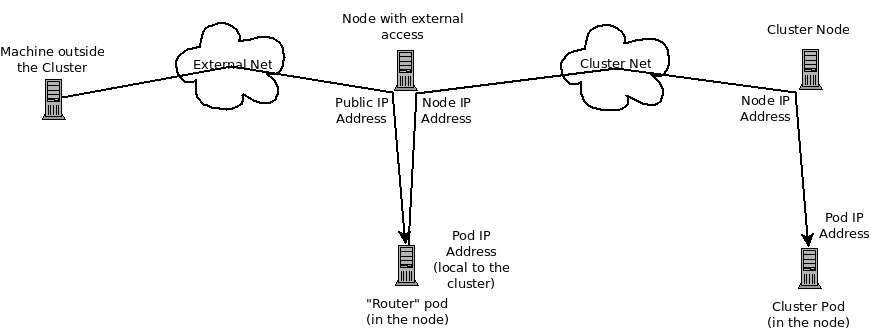

# openshift-sdn 故障处理
## 概观
如 [SDN文档](https://docs.openshift.com/container-platform/3.9/architecture/networking/sdn.html#architecture-additional-concepts-sdn)中所述 ，创建了多层接口，以便将流量从一个容器正确传递到另一个容器。为了调试连接问题，必须测试堆栈的不同层以确定问题出现的位置。本指南将帮助深入了解各个层次，以确定问题以及如何解决问题。

部分问题是 OpenShift 可以设置多种方式，并且在几个不同的地方网络可能是错误的。因此，本文件将通过一些方案来解决，这些方案有望涵盖大多数情况。如果未涵盖的问题，则引入的工具和概念应有助于指导调试工作。
## 名词解释
- Cluster

	集群由一组计算机组成，即 master 和 node
- Master

	openshift 集群的控制器所在。请注意，master 服务器可能不是群集中的节点，因此可能没有到 Pod 的 IP 连接
- Node

	运行可以托管 pod 的集群中的主机
- Pod

	在 node 节点运行的容器组，由 openshift 管理
- Service

	抽象的概念，提供一个或多个 pod 支持的统一网络接口 
- Router

	一种 web 代理，可以将各种 url 和路径映射到 openshift 服务，以允许外部流量进入集群
- Node Address

	节点的 ip 地址，这由节点所连接的网络的所有者分配和管理。必须可以从群集中的任何节点访问，包含（master 和 node）
- Pod Address

	pod的IP地址。这些由 OpenShift 分配和管理。默认情况下，它们是从 `10.128.0.0/14` 网络（或旧版本，`10.1.0.0/16`）中分配的。只能从 node 节点访问。
- Service Address

	表示服务的IP地址，并在内部映射到 pod 地址。这些由 OpenShift 分配和管理。默认情况下，它们被分配到 `172.30.0.0/16` 网络之外。只能从 node 节点访问。
	

## 调试一个对外部访问的HTTP服务
如果在群集外的计算机上并且正在尝试访问群集提供的资源，需要在 Pod 中运行进程，该进程侦听公共 IP 地址并 `路由` 群集内的流量。所述 OpenShift 路由器用于该目的，为 HTTP\HTTPS（与SNI）\WebSockets\或TLS（与SNI）。

假设无法从群集外部访问到 HTTP 服务，那么让首先在命令行上重现问题。尝试：

	curl -kv http://foo.example.com:8000/bar #URL 替换参数
如果有效，你是否从正确的地方复制了这个 bug？服务也有可能有一些工作，有些则没有。所以跳到 `调试路由器部分`。

如果失败，那么将 DNS 名称解析为IP地址（假设它不是一个):

	dig +short foo.example.com   #替换主机名
如果无法显示 IP 地址，则需要对 DNS 进行故障排除，但这超出了本指南的范围
		
	确保获得的 IP 地址是希望运行路由器的 IP 地址。如果不是，请修复的 DNS 服务。
接下来，使用和检查是否可以访问路由器主机。它们可能不响应 ICMP 数据包，在这种情况下，这些测试将失败，但路由器机器可能是可达的。在这种情况下，请尝试使用 `telnet` 命令直接访问路由器的端口: (`ping -c addresstracepath address`)

	telnet 1.2.3.4 8000
也许可以得到

	Trying 1.2.3.4...
	Connected to 1.2.3.4.
	Escape character is '^]'.	
如果是这样，那么服务的监听端口是正常的。然后退出 telnet。然后跳到 `调试路由器部分`

或者得到

	Trying 1.2.3.4...
	telnet: connect to address 1.2.3.4: Connection refused
这个指示告知路由器没有监听这个端口，更多请查看`调试路由器部分`

或者如果看到

	Trying 1.2.3.4...
	  telnet: connect to address 1.2.3.4: Connection timed out
这告诉无法与该 IP 地址上的任何内容交谈。检查路由，防火墙以及是否有路由器在侦听该 IP 地址。要调试路由器，请参阅 `调试路由器` 部分。对于 IP 路由和防火墙问题，调试超出了本指南的范围。

## 调试路由器
现在有了一个 IP 地址，需要 ssh 到那台机器并检查路由器软件是否在该机器上运行并正确配置。所以，先 ssh 那里获得管理 OpenShift 的凭证。

如果可以访问管理员凭据但不再以默认系统用户系统身份登录：`admin`，则只要凭据仍存在于CLI配置文件中，就可以随时以此用户身份重新登录 。以下命令登录并切换到默认 项目：

	$ oc login -u system：admin -n default
检查路由器是否正在运行：

	# oc get endpoints --namespace=default --selector=router
	NAMESPACE   NAME              ENDPOINTS
	default     router            10.128.0.4:80
如果命令失败，则 openshift 配置可能损坏。修复超出文档范围内容。应该看到列出了一个或多个路由器端点，但这不会告诉它们是否在具有给定外部IP地址的计算机上运行，​​因为端点 IP 地址将是群集内部的 Pod 地址之一。要获取路由器主机IP地址列表，请运行：

	# oc get pods --all-namespaces --selector=router --template='{{range .items}}HostIP: {{.status.hostIP}}   PodIP: {{.status.podIP}}{{end}}{{"\n"}}'
	HostIP: 192.168.122.202   PodIP: 10.128.0.4
应该看到与的外部地址对应的主机 IP。如果不这样做，请参阅[路由器文档](https://docs.openshift.com/container-platform/3.9/architecture/networking/routes.html#architecture-core-concepts-routes)以将路由器 pod 配置为在正确的节点上运行（通过正确设置关联）或更新 DNS 以匹配运行路由器的 IP 地址。

在本指南中，应该在节点上运行路由器 pod，但仍然无法使 HTTP 请求生效。首先，需要确保路由器将外部 URL 映射到正确的服务，如果可行，需要深入了解该服务以确保所有端点都可访问。

列出 OpenShift 知道的所有路由：

	# oc get route --all-namespaces
	NAME              HOST/PORT         PATH      SERVICE        LABELS    TLS TERMINATION
	route-unsecured   www.example.com   /test     service-name
	
如果 URL 中的主机名和路径与返回路由列表中的任何内容都不匹配，则需要添加路由。请参阅 [路由器文档](https://docs.openshift.com/container-platform/3.9/architecture/networking/routes.html#architecture-core-concepts-routes)。

如果的路由存在，则需要调试对端点的访问。这就像调试服务问题一样，所以继续下一个调试服务部分。

## 调试服务
如果无法从群集内部与服务进行通信（因为服务无法直接通信，或者因为正在使用路由器，并且一切正常，直到进入群集），那么需要确定哪些端点是与服务相关联并调试它们。

首先，获得服务：

	# oc get services --all-namespaces
	NAMESPACE   NAME              LABELS                                    SELECTOR                  IP(S)            PORT(S)
	default     docker-registry   docker-registry=default                   docker-registry=default   172.30.243.225   5000/TCP
	default     kubernetes        component=apiserver,provider=kubernetes   <none>                    172.30.0.1       443/TCP
	default     router            router=router                             router=router             172.30.213.8     80/TCP
应该在列表中看到服务。如果没有，那么需要定义服务。

服务输出中列出的 IP 地址是 Kubernetes 服务 IP 地址，Kubernetes 将映射到支持该服务的其中一个 pod。所以应该能够与该 IP 地址通信。但是，不幸的是，即使可以，也不意味着所有 pod 都可以到达; 如果不能，那并不意味着所有的 pod 都无法访问。它只是告诉你的状态，一个是 kubeproxy 上的钩子。

从一个节点测试一下这项服务

	curl -kv http://172.30.243.225:5000/bar  替换服务的 ip 地址和端口
然后，确定哪些 pod 支持服务（替换 `docker-registry` 为已损坏服务的名称）

	# oc get endpoints --selector=docker-registry
	NAME              ENDPOINTS
	docker-registry   10.128.2.2:5000
由此，可以看到只有一个端点。因此，如果您的服务测试成功，并且路由器测试成功，那么真的很奇怪。但是，如果有多个端点，或者服务测试失败，请对每个端点尝试以下操作。确定哪些端点不起作用后，请继续下一部分。

首先，测试每个端点（将URL更改为具有正确的端点IP，端口和路径）：

	curl -kv http://10.128.2.2:5000/bar
如果有效，那就试试下一个吧。如果失败了，请记下它，我们将在下一节中找出原因。

如果所有这些都失败了，那么本地节点可能无法正常工作，请跳转到`调试本地网络`部分。

如果所有这些都有效，那么跳转到`调试k8s`部分以找出服务 IP 地址无法正常工作的原因。
## 调试节点到节点网络
使用我们的非工作端点列表，我们需要测试与节点的连接。

1. 确保所有节点都具有预期的 IP 地址：

		# oc get hostsubnet
		NAME                   HOST                   HOST IP           SUBNET
		rh71-os1.example.com   rh71-os1.example.com   192.168.122.46    10.1.1.0/24
		rh71-os2.example.com   rh71-os2.example.com   192.168.122.18    10.1.2.0/24
		rh71-os3.example.com   rh71-os3.example.com   192.168.122.202   10.1.0.0/24
	如果使用 DHCP，他们可能已经更改。确保主机名，IP 地址和子网符合您的预期。如果任何节点详细信息已更改，请使用 `oc edit hostsubnet` 更正条目。
2. 确保节点地址和主机名正确后，列出端点 IP 和节点 IP

		# oc get pods --selector=docker-registry \
		    --template='{{range .items}}HostIP: {{.status.hostIP}}   PodIP: {{.status.podIP}}{{end}}{{"\n"}}'
		
		HostIP: 192.168.122.202   PodIP: 10.128.0.4
3. 找到之前记下的端点 IP 地址 Pod IP，并在条目中查找，并找到相应的 `HostIP` 地址。然后使用以下地址在节点主机级别测试连接 `HostIP`：

	- `ping -c 3 <IP_address>`：没有响应可能意味着中间路由器正在吃 `ICMP` 流量。
	- `tracepath <IP_address>`：如果所有跃点都返回 ICMP 数据包，则显示到目标的 IP 路由。
	- 如果同时 `tracepath` 和 `ping` 失败，然后再寻找与当地的或虚拟的网络连接问题。
4. 对于本地网络，请检查以下内容：
	-	检查数据包从包装盒中取出的路径到目标地址：

			# ip route get 192.168.122.202
			  192.168.122.202 dev ens3  src 192.168.122.46
			    cache
		在上面的例子中，它将输出以 `ens3` 源地址命名的接口，`192.168.122.46` 并直接转到目标。如果这是所期望的，请使用 `ip a show dev ens3` 获取接口详细信息并确保它是预期的接口。

		替代结果可能如下：

			# ip route get 192.168.122.202
			  1.2.3.4 via 192.168.122.1 dev ens3  src 192.168.122.46
			
		它将通过 via IP 值进行适当的路由。确保流量正确路由。调试路由流量超出了本指南的范围。

可以使用以下方法解决节点到节点网络的其他调试选项：

- 你有两端的以太网链接吗？`Link detected: yes` 在输出中查找 `ethtool <network_interface>`。
- 您的双工设置和两端的以太网速度是否正确？查看其余 `ethtool <network_interface>` 信息。
- 电缆是否正确插入？到正确的端口？
- 交换机配置正确吗？

一旦确定节点到节点的连接正常，我们就需要查看两端的SDN配置。