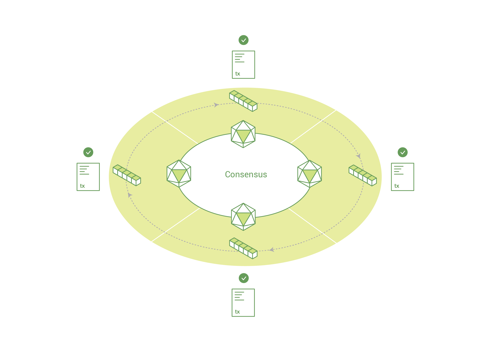
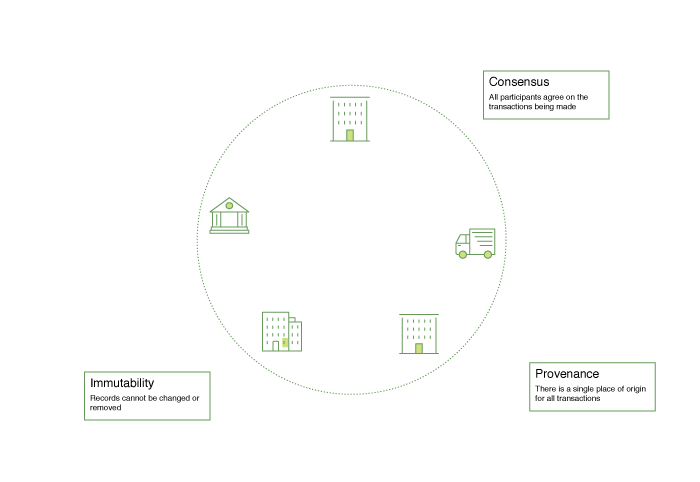

# Fabric 学习笔记 1
## 区块链基础
### 分布式账本
一个区块链网络的核心是一个分布式账本，在这个账本中记录了网络中发生的所有交易信息。

区块链账本“通常被定义为去中心化“(也就是可能不是去中心化)。在整个网络中，每个参与者都保存着一个区块链账本的副本(注意是每节点全量数据保存，类似 git 已提供共识计算的数据可能和效率)，所有参与者通过协作共同维护着账本。

区块链的另一个显著特点是数据使用内容寻址技术存储，保证数据不被篡改。区块链的这种不可篡改性使得信息来源的确认变得异常容易，这是由于参与者可以肯定数据写入读出的一致性，所以被称为可信系统的原因。
### 智能合约(Smart_Contract)
为了持续的进行信息的更新，以及对账本进行管理（写入交易，进行查询等），以以太坊为首的第二代区块链网络引入了`智能合约`，来实现对账本的访问和控制。

智能合约不仅仅可用于在区块链网络中打包信息，它们也可以被用于自动的执行由参与者定义的特定交易操作。

例如，买卖双方可以定义一个智能合约，以保证当卖方发货的商品运送到达时，买方支付的货款会自动转账给卖方。

上图简单流程

1. 两个参与者制定智能合约并完成
- 双方确认交易，更新交易信息
- 交易信息记账入链

### 共识
保持网络中所有账本交易的同步流程，就是共识。共识保证了账本只会在交易双方都确认后才进行更新。同时在账本更新时，交易双方能够在账本中的相同位置，更新一个相同的交易信息。

根据以上特点，每个节点最少需要做两件事

1. 每个节点存储共识的数据(历史区块)必须相同(非区块数据可以不同)，且必须是全量数据
2. 对每次交易，共识节点都需要独立计算得到相同结果，才算共识，只有达到交易双方全部共识，才会申请更新数据，这里必须一致更新到区块上且验证后，这个数据才算共识数据。

### 区块链的需求
- 当前记账系统
	- 描述 
		- 虽然交易的物品(人口买卖到卫星发射)和记账的方法变动(从石碑到硬盘),但底层流程架构并没有发生任何变化
		- 不存在管理整个交易网络参与者的管理者 
		- 全部手工记录
		- 交易流程中的所有参与者都建立一套自己的系统，维护一套自己的记账数据管理体系
		- 每套记账体系可能存在自己的错误或者通用错误 
	- 当前网络结构图
	
		
		
		- 提供中心数据库昂过到无法承担
		- 整体网络是脆弱的，容易出现问题和被攻击
		- 整体网络低效
- 区块链优势
	- 描述
	
		提供具有标准的方法建立身份信息，执行交易，并且存储数据。通过查询这个链上的所有交易，来确定交易商品来源，并且这个链上的信息一旦被写入，就无法被再次篡改或删除。
	- 未来网络结构图
	
		
		
		- 参与方之间达成共识
		- 内容不可更改和删除
		- 每个节点记录全量共识数据
	- 优势 
		
		通过使用共享账本协调整个商业网络，区块链网络能够减少时间、成本以及隐私信息泄露的风险，并且能使流程更加可信和透明。

## Fabric 相关  
## 什么是 Hyperledger Fabric
Fabric 包含一个账本，使用智能合约并且是一个通过所有参与者管理交易的系统。它是一个提供分布式账本解决方案,由模块化架构支撑，并具备极佳的保密性、可伸缩性、灵活性和可扩展性。Linux基金会项目，目标是发展跨行业的区块链技术。它被设计成支持不同的模块组件直接拔插启用，并能适应在经济生态系统中错综复杂的各种场景。

Fabric 与其他区块链系统最大的不同体现在私有和许可。与开放无需许可的网络系统允许未知身份的参与者加入网络不同（需要通过工作量证明协议来保证交易有效并维护网络的安全），Hyperledger Fabric通过 `Membership Service Provider (MSP)`来登记所有的成员。

Fabric 提供了独特的 channel 的功能，这允许参与者为交易新建一个单独的账本。当网络中的一些参与者是竞争对手时，这个功能变得尤为重要。因为这些参与者并不希望所有的交易信息——比如提供给部分客户的特定价格信息——都对网络中所有参与者公开。只有在同一个 channel 中的参与者，才会拥有该channel 中的账本，而其他不在此 channel 中的参与者则看不到这个账本。
### 共享账本
Fabric 包含一个账本子系统，这个子系统包含两个组件

- 交易记录(区块链)

	交易记录组件记录了产生“世界状态”当前值的所有交易，世界状态的所有的变更历史记录。记录是一组不可更改的有序的区块（数据块），记录着全部交易的日志。每个区块中包含若干个交易的数据，不同区块所包含的交易数量可以不同。
- 世界状态(world state)

	世界状态组件描述了账本在“当前”时间点的状态数据,相当于对当前账本的交易数据做了索引。链码执行交易的时候需要读取账本的当前状态，从状态数据库可以迅速获取键值的最新状态。

	如果没有状态数据库，要获得某个键值时，需要遍历整个区块链中和该键值相关的交易，效率非常低，因此，读取状态数据库可以认为是快速定位和访问某个键值的方法。另外，当状态数据库出现故障的时候，可以通过遍历账本重新生成。
	
	状态数据库可以是各种键值数据库，Fabric缺省使用LevelDB。。交易记录模块不需要被接入，只需要记录在区块链网络中账本数据库被使用时之前和之后的值就可以了。

账本是由交易记录的区块链-"有顺序和防篡改的记录(注意这里顺序和防篡改很重要)"和世界状态的索引数据库组成。在 Fabric 中的每一个参与者都拥有一个账本的副本。

### 智能合约
Fabric 智能合约被称为 chaincode，当一个区块链外部的一个应用程序需要访问账本时，就会调用chaincode。大多数情况下，chaincode 只会访问账本的数据库(世界状态)组件中的数据（比如查询），但不会查询交易记录。

chaincode 可通过多种不同编程语言实现。目前支持 chaincode 的语言是 Go（包含对java的支持）
### 隐私
根据需求在一个 Business-to-Business（B2B）网络中的参与者会对信息共享的程度极为敏感。然而，对于其他的网络，隐私并不是首要考虑的因素。

Fabric 支持构建隐私保护严格的网络，也支持构建相对开放的网络。
### 共识
在网络中，不同的参与者写入的交易必须按照产生"顺序"依次被写入账本中。要实现这一目标，交易顺序必须被正确的建立并且必须包含拒绝错误（或者恶意）插入账本中的无效交易的方法。

Fabric 被设计为允许网络构建者依据业务需求来选择采用的共识机制。好比考虑隐私性，就会有一连串的需求，从高度结构化(数据库)的网络或是更加点对点(p2p)的网络。共识机制目前包含 SOLO，Kafka 以及后续会添加的 SBFT (Simplified Byzantine Fault Tolerance)。

## 参考
[官方翻译文档](https://hyperledgercn.github.io/hyperledgerDocs/blockchain_zh/#_1)

[HyperLeger Fabric开发（五）——HyperLeger Fabric账本存储](https://blog.51cto.com/9291927/2316594)