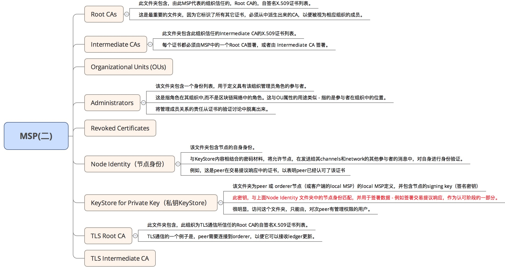
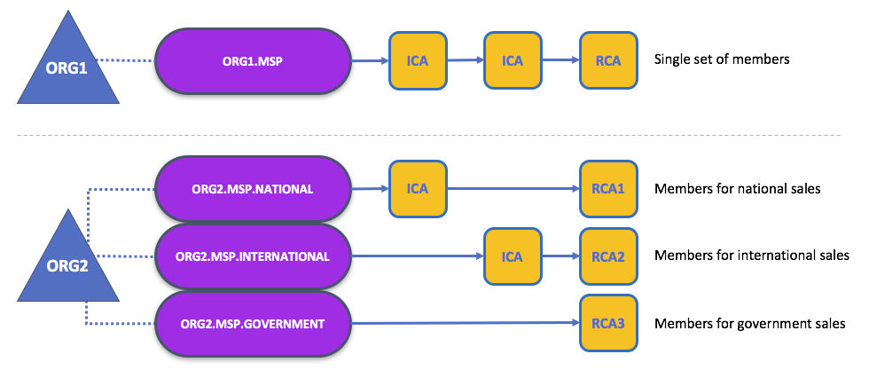

# Fabric 学习笔记 5 (操作指南)
## 成员服务提供者 （MSP-Membership service provider）
成员服务提供者（MSP）是一个提供抽象化成员操作框架的组件。

特别地，MSP 将颁发与校验证书，以及用户认证背后的所有密码学机制与协议都抽象了出来。一个 MSP 可以自己定义身份，以及身份的管理（身份验证）与认证（生成与验证签名）规则。

一个 Hyperledger Fabric 区块链网络可以被一个或多个 MSP 管理。这提供了模块化的成员操作，以及兼容不同成员标准与架构的互操作性。
### MSP 包含什么说明

### MSP 如何工作

### MSP 配置
要想初始化一个 MSP 实例，每一个 peer 节点和 orderer 节点都需要在本地指定其配置，并在 channel 上启用 peer 节点、orderer 节点及 client 的身份的验证与各自的签名验证。注意 channel 上的全体成员均参与此过程。

首先， 为了方便地在网络中引用 MSP，每个 MSP 都需要一个特定的名字（例如 msp1、org2、org3.divA）。在一个 channel 中，当 MSP 的成员管理规则表示一个团体，组织或组织分工时，该名称会被引用。这又被称为 MSP 标识符或 MSP ID。对于每个 MSP 实例，MSP 标识符都必须独一无二。

举个例子：系统 channel 创建时如果检测到两个 MSP 有相同的标识符，那么 orderer 节点的启动将以失败告终。

在 MSP 的默认情况下，身份（证书）验证与签名验证需要指定一组参数。这些参数推导自RFC5280，具体包括：

- 一个自签名的证书列表（满足X.509标准）以构成信任源
- 一个用于表示该 MSP 验证过的中间 CA 的 X.509 的证书列表，用于证书的校验。这些证书应该被信任源的一个证书所认证；中间的 CA 则是可选参数
- 一个具有可验证路径的 X.509 证书列表（该路径通往信任源的一个证书），以表示该 MSP 的管理员。这些证书的所有者对 MSP 配置的更改要求都是经过授权的（例如根 CA，中间 CA）
- 一个组织单元列表，该 MSP 的合法成员应该将其包含进他们的 X.509 证书。这是一个可选的配置参数，举个例子：当多个组织使用相同信任源、中间 CA 以及组织为他们的成员保留了一个 OU 区的时候，会配置此参数
- 一个证书吊销列表（CRLs）的清单，清单的每一项对应于一个已登记的（中间的或根） MSP 证书颁发机构（CA）(可选的参数)
- 一个自签名的证书列表（满足X.509标准）以构成 TLS 信任源，服务于 TLS 证书
- 一个表示该 provider 关注的中间TLS CA的X.509证书列表。这些证书应该被TLS信任源的一个证书所认证；中间的CA则是可选参数

对于该 MSP 实例，有效的身份应符合以下条件

- 它们应符合X.509证书标准，且具有一条可验证的路径（该路径通往信任源的一个证书）
- 它们没有包含在任何 CRL 中
- 它们列出了一个或多个 MSP 配置的组织单元（列出的位置是它们X.509证书结构的OU区内）。

关于当前 MSP 实现过程中身份验证的更多信息，[MSP Identity Validity Rules](http://hyperledger-fabric.readthedocs.io/en/latest/msp-identity-validity-rules.html)

除了验证相关参数外，为了使 MSP 可以对已实例化的节点进行签名或认证，需要指定

- 用于节点签名的签名密钥（目前只支持 ECDSA 密钥）
- 节点的 X.509 证书，对 MSP 验证参数机制而言是一个有效的身份

值得注意的是，MSP 身份永远不会过期；它们只能通过添加到合适的 CRL 上来被撤销。此外，现阶段不支持吊销 TLS 证书。

### 如何生成MSP证书及其签名密钥？
要想生成 X.509 证书以满足 MSP 配置，应用程序可以使用 Openssl。必须强调：在Hyperledger Fabric 中，不支持包括 RSA 密钥在内的证书。另一个选择是使用cryptogen工具.

Hyperledger Fabric CA 也可用于生成配置 MSP 所需的密钥及证书。
### peer&orderer侧 MSP 的设置
要想（为 peer 节点或 orderer 节点）建立本地 MSP，管理员应创建一个文件夹（如`$MY_PATH/mspconfig`）并在其下包含6个子文件夹与一个文件：

- `admincerts`

	包含如下PEM文件：每个PEM文件对应于一个管理员证书
- `cacerts`

	包含如下PEM文件：每个PEM文件对应于一个根CA的证书
- （可选）`intermediatecerts`

	包含如下PEM文件：每个PEM文件对应于一个中间CA的证书
- （可选）`config.yaml`(文件)

	包含相关OU的信息；后者作为 `<Certificate,OrganizationalUnitIdentifier>`（一个被称为 `OrganizationalUnitIdentifiers` 的 yaml 数组的项）的一部分被定义；其中`Certificate` 表示通往（根或中间）CA 的证书的相对路径，这些 CA 用于为组织成员发证（如 `./cacerts/cacert.pem`）；`OrganizationalUnitIdentifier` 表示预期会出现在 X.509 证书中的实际字符串（如“COP”）
- （可选）`crls`

	包含相关CRL
- `keystore`

	包含一个PEM文件及节点的签名密钥；我们必须强调：现阶段还不支持RSA密钥
- `signcerts`

	包含一个PEM文件及节点的X.509证书
- （可选）`tlscacerts`

	包含如下PEM文件：每个PEM文件对应于一个根TLS根CA的证书
- （可选）`tlsintermediatecerts`

	包含如下PEM文件：每个PEM文件对应于一个中间TLS CA的证书
	
在节点的配置文件中（对 peer 节点而言配置文件是 `core.yaml` 文件，对 orderer 节点而言则是 `orderer.yaml` 文件），需要指定到 `mspconfig` 文件夹的路径，以及节点的 MSP 的 MSP 标识符。到 `mspconfig` 文件夹的路径预期是一个对`FABRIC_CFG_PATH` 的相对路径，且会作为参数 `mspConfigPath` 和 `LocalMSPDir` 的值分别提供给 peer 节点和 orderer 节点。节点的 MSP 的 MSP 标识符则会作为参数 `localMspId` 和 `LocalMSPID` 的值分别提供给 peer 节点和 orderer 节点。

运行环境可以通过为 peer 使用 CORE 前缀（例如 `CORE_PEER_LOCALMSPID`）及为 orderer 使用 ORDERER 前缀（例如 `ORDERER_GENERAL_LOCALMSPID`）对以上变量进行覆写。

注意：对于 orderer 的设置，需要生成并为 orderer 提供系统 channel 的创世区块。MSP 配置对该区块的需求详见后面的章节。	

对“本地”的 MSP 进行重新配置只能手动进行，且该过程需要重启 peer 节点和 orderer 节点。在随后的版本中我们计划提供在线/动态的重新配置的功能（通过使用一个由节点管理的系统 chaincode，使得我们不必停止 node）

### Channel MSP 的设置
在系统起始阶段，我们需要指定在网络中出现的所有 MSP 的验证参数，且这些参数需要在系统 channel 的创世区块中指定。前文提到，MSP 的验证参数包括 MSP 标识符、信任源证书、中间 CA 和管理员的证书，以及 OU 说明和 CLR。系统的创世区块会在 orderer 节点设置阶段被提供给它们，且允许它们批准创建 channel 的请求。如果创世区块包含两个有相同标识符的 MSP，那么 orderer 节点将拒绝系统创世区块，导致网络引导程序执行失败。

对于应用程序 channel，创世区块中需要包含管理 channel 的那部分 MSP 的验证组件。应用程序要肩负以下责任：在令一个或多个 peer 节点加入到 channel 中之前，确保 channel 的创世区块（或最新的配置区块）包含正确的 MSP 配置信息。

在 configtxgen 工具的帮助下引导架设 channel 时，我们这样来配置 channel MSP：将 MSP 的验证参数加入 mspconfig 文件夹，并将该路径加入到 `configtx.yaml` 文件的相关部分。

要想对 channel 中 MSP 的重新配置，包括发布与 MSP 的 CA 相关的证书吊销列表，需要通过 MSP 管理员证书的所有者创建 `config_update` 对象来实现。由管理员管理的客户端应用将向该 MSP 所在的各个 channel 发布更新。
### 最佳实践
将详述一般情况下 MSP 配置的最佳实践

1. 为组织与 MSP 建立映射

	建议组织和 MSP 之间建立一一映射。如果选择其他类型的映射，那么需要注意以下几点：
	
	- 一个组织对应多个 MSP

		这对应于下面这种情况：（无论出于独立管理的原因还是私人原因）一个组织有各种各样的部门，每个部门以其 MSP 为代表。在这种情况下，一个 peer 节点只能被单个 MSP 拥有，且不会识别相同组织内标识在其他 MSP 的节点。这就是说，peer 节点可以与相同子分支下的一系列其他 peer 节点共享组织数据，而不是所有构成组织的节点。
	- 多个组织对应一个MSP

		这对应于下面这种情况：一个由相似成员结构所管理的组织联盟。这时，peer 节点可以与相同 MSP 下的其他节点互发组织范围的数据，节点是否属于同一组织并不重要。这对于 MSP 的定义及 peer 节点的配置是个限制。
2. 一个组织有多个分支（称为组织单元），各个分支连接到组织想要获取访问权限的不同 channel

	有两个方法进行处理：
	
	- 定义一个 MSP 来容纳所有组织的全部成员。MSP 的配置包含一个根 CA、中间 CA 和管理员证书的列表；成员身份会包含一个组织单元（OU）的所属关系。接下来可以定义用于获取特定 OU 成员的策略，这些策略可以建立 channel 的读写策略或者 chaincode 的背书策略。这种方法的局限是 gossip peer 节点会本地 MSP 下的其他 peer 节点当做相同组织内的成员，并与之分享组织范围内的数据。
	- 定义一个 MSP 来表示每个分支。这需要为每个分支引入一组根CA证书、中间CA证书和管理员证书，这样每条通往 MSP 的路径都不会重叠。这意味着，每个子分支的不同中间CA 都会被利用起来。这样做的缺点是要管理多个 MSP，不过这避免了前面方法出现的问题。也可以利用 MSP 配置的 OU 扩展来为每个分支定义一个 MSP。
3. 将客户从相同组织的 peer 节点中分离

	多数情况下，一个身份的“类型”被要求能够从身份本身获取（可能当背书要保证：背书节点由 peers 充当，而非客户端或者仅充当 orders 的节点时，需要该特性支持）。下面是对这些要求的有限支持。
	
	一种支持这种分离的方法是为每个节点类型创建一个分离的中间 CA：一个为客户，一个为 peer 节点或 orderer 节点；并配置两个不同的MSP：一个为客户，一个为 peer 节点或 orderer 节点。该组织要访问的 channel 需要同时包含两个 MSP，不过背书策略将只用到服务 peer 节点的 MSP。这最终导致组织与两个 MSP 实例建立映射，并对 peer 节点与客户间的交流产生特定影响。由于所以同一组织的 peer 节点仍属于相同的 MSP，所以通讯不会受到严重影响。 peer 节点可以把特定系统 chaincode 的执行控制在本地 MSP 的策略范围内。
	
	例如：只有请求被本地 MSP 的管理员签署（其只能是一个客户），peer 节点才会执行“joinChannel” 的请求（终端用户应该处于该请求的起点）。如果我们接受这样一个前提：只有客户成为 MSP peer 节点或 orderer 节点的一员，才能成员 MSP 的管理员，那么我们就可以绕过这个矛盾。该方法还要注意，peer 节点授权事件登记的请求，是基于本地 MSP 内请求的发起成员。简而言之，由于请求的发起者是一个客户，故请求发起者必定隶属于和被请求的 peer 节点不同的 MSP，这会导致 peer 节点拒绝该请求。
4. 管理员和CA的证书

	将 MSP 管理员证书设置得与任何 MSP，或中间 CA 处理的其他证书都不同是很重要的。这是一种常见的安全做法，即将成员管理的责任从发行新证书与验证已有证书中拆分出来。
5. 将中间 CA 加入黑名单

	就像上文所述，重新配置 MSP 是通过一种重配置机制完成的（手动重新配置本地 MSP 实例，并通过 channel 合理构建发送给 MSP 实例的 `config_update` 消息）。显然，我们有两种方法保证一个中间 CA 被 MSP 身份验证机制彻底忽视：
	
	- 重新配置 MSP 并使它的信任中间 CA 证书列表不再包含该中间 CA 的证书。对于本地重新配置的 MSP，这意味着该 CA 的证书从 `intermediatecerts` 文件夹中被删除了。
	- 重新配置 MSP 并使它包含由信任源产生的 CRL，该 CRL 会通知 MSP 废止中间 CA 证书的使用。

	在目前的 MSP 只支持上述的第一个方法，因为它更加简单，且并不需要把早就不用考虑的中间CA列入黑名单。	
6. CA 和 TLS CA

	MSP 身份的根 CA 及 MSP TLS 证书的根 CA（以及相关的中间 CA）需要在不同的文件夹中声明。这是为了避免混淆不同等级的证书。且 MSP 身份与 TLS 证书都允许重用相同的 CA，不过我们建议最好在实际中避免这样做。
	
## 参考
- [成员服务提供者 （MSP）](https://hyperledgercn.github.io/hyperledgerDocs/msp_zh/)
- [Hyperledger系列（十五）MSP图解](https://blog.csdn.net/maixia24/article/details/79932820)		
		
	

			