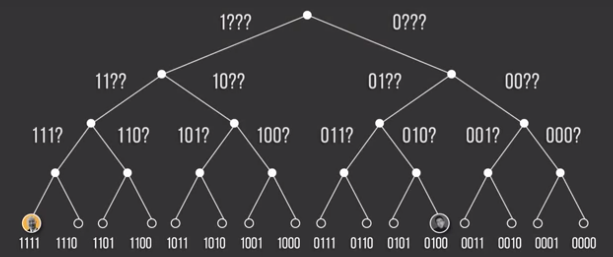
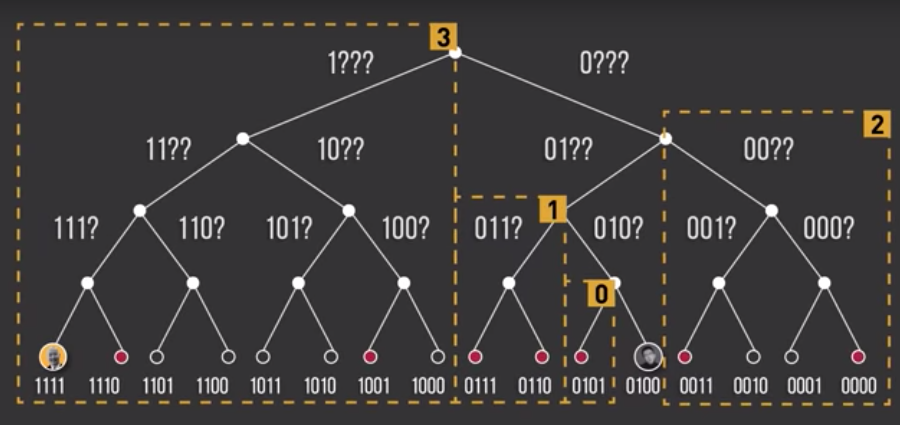
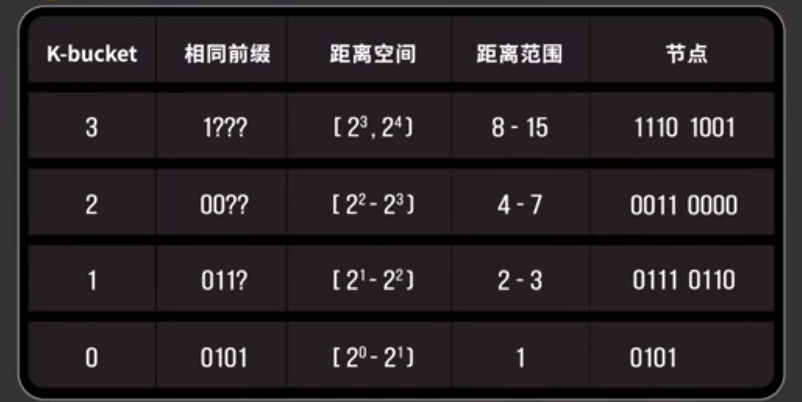
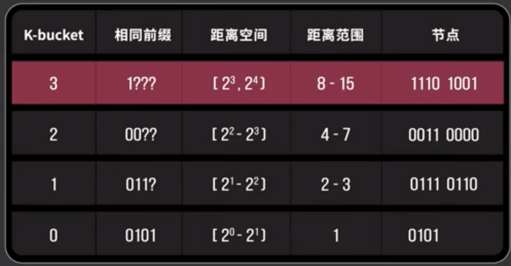

# DHT 算法原理
## 初始解决节点之间相互寻址的方法
### 步骤
- 比如 A 节点链接 10个 已知节点去找B
	-  10个节点并没有b
		- 他们各自又去自己的 10 个已知节点查询
			- 已此循环
			- 最后找到 B 节点
- A 节点连接到 B 节点

### 问题
这样会导致大量的广播，占用大量的额外带宽
## DHT
 
### 步骤
- 发布者
	- 由文件生成了 hash 值为 40 位 16 进制，转换为2进制就是 160 位
	- 使用公钥使用相同方法也生成同样的 hash，然后转换成 160 位2进制
	- 可以计算2个距离
		- 节点和节点
		- 节点和文件
	- 文件发布者就找寻与文件距离最短的一批节点 id，将发布者提供的下载信息(下载列表)存放在这些节点上。
- 下载者
	- 同样拿到文件的 hash 值
	- 使用和发布者一样的方法，就可以找到下载信息存放的节点
	- 然后根据下载信息进行下载 
	
### 算法
引入了逻辑距离(也就是算法)，使用异或算法进行计算

- 先计算文件 hash 和你节点的距离，文件hash2进制^节点hash2进制，再转换成10进制得到距离
- 将所有节点 hash 转换成二进制引入2进制的二叉树

	 
- 160 位生成 160 层二叉树,图中因为使用的是4位，所以使用了4层二叉树
- 然后不管是发布者还是下载者都需要找到和文件 hash 最近的节点
- 先把二叉树分为160个子树，然后每颗子树选2个点，如图是拆分了4个子树

	 
- 使用你的节点值和选出来的每科子树的2个节点进行异或计算，得到你的节点和这些节点的距离

	 
- 然后在用这些距离和文件与你的节点距离做比对，找到最近的两个节点

	  
- 然后询问这两个节点，就可以得到最终文件数据下载信息放在那个节点上了
- 然后发布者就可以连接些节点发布信息，而下载者就可以连接这些信息进行下载
- 下载完毕后，还可以使用 hash 来验证下载数据的真实性 
 
## Kademlia
以上讲的是原理，基于 DHT 原理，有很多 DHT 实现，最直接的目标就是以最快的速度来定位到期望的节点。为了能快速完成这160棵子树计算，处于 DHT 网络中的每一个节点都记录了每棵子树上的 k 个节点的信息（ip,port,id），在BT中K固定为8， 也就是说，在 bt 的 DHT 网络中，每个节点都记录了每颗子树的8个节点信息，包含 ip,port,id，总共约为 1280 个。当然越靠近节点层，越可能少于8个节点，比如离自己节点最近的层，只记录1个节点。

这里8个节点就称为 k 桶，也称为路由表

### 新加节点流程
每一个新加入到 DHT 网络的节点最开始这些“路由表”信息都是空的，它有以下几个方式可以来逐步生成和形成自己的“路由表”信息：

1. 如果本节点曾经启动过程，则从保存的“路由表”文件中直接读取然后刷新该“路由表“
2. 如果该节点第一次启动（比如新安装 BTSpilits 然后启动），并且该节点自带有“超级节点“则通过这些“超级节点“来间接地生成自己的”路由表“（在 Kashmir 的某个版本中有一个文件保存这些”超级接点的信息“，BTSplits, BTcomet, eMules 则内嵌有 20 多个）
3. 如果第一次启动的节点没有这些所谓的“超级节点”(比如 Mainline 则没有这个功能)，则它的路由表生成过程需要推迟到 download 文件过程。它会从它获取到的种子文件中提取 nodes 字段，该字段是做种子（支持 DHT 网络的种子）的时候生成的，一般 nodes 字段设置为该原始种子的 ip 和 port，或者是做种子的节点离该种子的 info-hash 最近的 k 个节点。通过这些 nodes 字段中的节点通过来间接地生成自己的路由表。
4. 动态建立过程，该过程为节点经过上面的初始化后，在下载或者上传或者无任务过程中有收到任何节点发送的任何消息，都会去检查当前的“路由表”并尝试按照一定的规则去建立/刷新路由表。

DHT实现中包括两种类型的查找

- 一种是查找nodes(find_nodes)

	查找nodes的过程主要是为了建立本地的“路由表”，它的最终目的是后面查找 peers。
	
	- 过程
		- 节点 x 需要查找节点 y
		- x 首先从 xor(x,y) 对应的本地 K 桶中得到 k 个比较接近的节点
		- 然后向这些比较接近的 k 个节点继续询问它是否有离 y 更近的节点
		- 这些 k 个节点当然也从自己的对应的 K 桶中返回 k 个更近的节点给 x
		- x 然后再从返回结果中选取 k 个更更接近的节点重复上面的动作不能返回更近的节点为止，则最后找到的 k 个节点即为最接近的 nodes

		在这个过程中返回的任何 k 个接近的节点都会尝试去插到自己的路由表中 
- 一种是查找 peers（get_peers）

	x 查找 peers-list 的方法则和上面查找节点的方法类似，不同的是它以数据 hash(Info-hash) 作为参数进行查找，并且如果在查找过程中有任何一个节点返回了 (数据 hash, peers-list) 对则提前结束查找。

### 数据活动节点信息过程
- 一个节点通过上面方法得到了 peers-list 后，则会试图对每个 peers 主动发起 TCP 的连接继续后面真实的下载过程（该过程由 peer-peer protocol 协议规定），同时会把自己的 peer 信息发送给先前的告诉者和自己 K 桶中的 k 个最近的节点存储该 peer-list 信息。
- 该信息在该 k 个节点上可以保存24个小时，24小时后如果没有收到 x 发送的更新消息则失效。

一个活动的节点存储有两部份的信息

- 一部分是本地的“路由表”，
- 一部分则是(数据 hash, peers-list)列表信息（可有多个）。

Info-hash 的值当然也属于(0-2160)空间的一部分，但是它和节点 id 不同，节点 ID 是可以作为那棵无形的二叉前缀树的叶子（为什么是无形的，因为每个节点其实是没有用数据结构来存储这个棵的树的），而 info-hash 则只能附着在离它的值最近的 node id 上面。

### KRPC
为了实现上面的“路由表”建立，刷新，获取 peers-list,保存 peers-list 这些功能，kademlia 定义四个最基本的KRPC操作:

- ping 操作

	探测一个节点用以判断该节点是否仍然在线

	- Ping Request

			d1:ad2:id20:xxxxxxxxxxxxxxxxxxxe1:q4:ping1:t4:tttt1:y1:qe
			表示的含义：此操作为ping操作请求，参数为发送者的id是：xxxxxxxxxxxxxxxxxx
	- Ping Reponse

			d1:rd2:id20:yyyyyyyyyyyyyyyyyy e1:t4:1:y1:re
			返回的数据中只包括有一个响应者的id信息。
- store 操作

	作用是通知一个节点存储一个 <key,value> 对，以便以后查询需要
	
	- announce _peers 请求

			d1:ad2:id20:xxxxxxxxxxxxxxxxx9:info_hash20:zzzzzzzzzzzzzzzzzz4:porti10756e5:token20:ooooooooooooooooo1:q13:announce_peer1:t4:tttt1:y1:qe
			表示的含义是：此操作为announce_peer请求操作，告诉对端我这边对info-hash文件上传和下载，可以成为peers list中的一员，端口号是10756.
	- Announce_peer Reponse

			d1:rd2:id20:xxxxxxxxxxxxxxxxxxxx2:ip4:pppp1:t4:tttt1:v4:UTb*1:y1:re
			附件为抓取的分别为为一简单下载过程/一初始初始化路由表的数据包：可以对照进行分析
- find_node 操作

	作用是从自己的“路由表”对应的 K 桶中返回 k 个节点信息(IP address,UDP port,Node ID)给发送者
	
	- find_node Request

			d1:ad2:id20:xxxxxxxxxxxxxxxxxxxx6:target20:yyyyyyyyyyyyyyyyyyyy1:q9:find_node1:t4:1:y1:qe
			表示的含义：此操作为find_node请求，参数为发送者id及目标节点的id
	- find_node Reponse

			d1:rd2:id20:xxxxxxxxxxxxxxxxxxxx5:nodes208:nnnnnnnnnnnnn5:token20:ooooooooooooo1:t4:ttt 1:y1:re
			表示的含义是：找到了8个最近的节点，nodes208表示8个node信息（ip,port,id）共208Bytes
- faind_value 操作

	作用是把 info-hash 作为参数，如果本操作接收者正好存储了 info-hash 的 peers 则返回peers list，否则从自己的“路由表“中返回离 info-hash 更近的 k 个节点信息（同find_node过程）。

	- Get_peers 请求
		
			d1:ad2:id20:xxxxxxxxxxxxxxxxxxxx9:info_hash20:zzzzzzzzzzzzzzzzzzzze1:q9:get_peers1:t4:tttt1:y1:qe
			表示的含义：此操作为get_peers操作请求，参数为：发送者的id和要查询种子的info-hash。

	Get_peers响应格式有两种，一种是找到了节点含有该 info-hash 的 peers 列表信息，如下格式：

	- 找到表示含义

			d1:rd2:id20:xxxxxxxxxxxxxxxxxxx5:token20:ooooooooooooooooooo6:valuesl6:(ip1,port1)+(ip2,port2)+(ipi,porti)…e1:t4:tttt1:y1:re
			(values后面跟上的则是peers列表，ip, port)

	- 没有找到列表信息

			d1:rd2:id20:xxxxxxxxxxxxxxxx5:nodes208:nnnnnnnnnnnnnnnnnnnnnnnnnnnnnnnnnnnn 5:token20:ooooooooooooooo1:t4:tttt1:y1:re
			没有找到存有info-hash的节点，但找到了离该info-hash更近的8个节点，nodes208表示8个node信息（ip,port,id）共208bytes

	
## Bttorent DHT实现几个重要过程
- 创建路由
	- 从 routing_table 文件中装载”路由表”K桶信息，初始化内存“路由表”信息
	- 强制刷新“路由表“中的每一个K桶，刷新过程是随机产生 id 进行 findNode 查找
		- 刷新路由表
			- 三种刷新规则 
				- 启动的时候进行强制刷新
				- 每15分钟如果K桶中的信息没有进行更新的话，则进行刷新一次K桶，即 refreshTable
					- refreshTable（force=1）过程
						- 如果 force=1，则对当前每个 K 桶都进行刷新
						- 如果 K 桶当前 nodes 数小于k（8），则也进行刷新
						- 如果 K 桶中存在无效的节点，即连续三个消息没有收到响应的节点
						- 如果 K 桶中所有节点没有交互的时间超过15分钟，则也进行刷新
				- 每5分钟进行一次 checkpoint 操作，以把当前的路由表存放到 routing_table 文件中
			- routing_table 文件格式
		
					{'id':node.id, 'host':node.host, 'port':node.port, 'age':int(node.age)}
		- “路由表”的动态建立过程
		
			 当一个节点收到任何一个 RPC 消息（请求和响应后（ping/find/getPeers/announce_peer）都会去检查一下该消息的发送者是否在本地的“路由表“中，如果该发送者已经存在节点的本地“路由表”中，则会把该发送者从其对应的 K 桶移动到该 K 桶的末尾。如果该发送者不在节点的“路由表”中则会去尝试插入到本地”路由表“K桶中
			 
			 - 找到该发送者的对应的 K 桶
			 - 如果该节点是响应消息中发现的，则更新该节点 lastSeen = time() 时间
			 - 如果 K 桶小于 k（8）则直接插到该 K 桶后面
			 - 如果 K 桶已经满了，则检查是否有无效的节点
			 	- 如果有则把这些无效节点删除，并把该节点放入K桶末尾。（但后面会对这些早已经存在的节点进行再一次的ping操作，来进一步确定是否无效了，如果收到响应，则把这些节点重新放如K桶）
			 	- 如果所有的节点都是有效的，则需要查看自身是否在该 K 桶中（即该K桶是否是自己所在的K桶）
			 		- 如果是则直接丢弃该节点
			 		- 如果K桶不是自身所在的K桶，则需要进行K桶分拆。拆分的方法即是一个变为两个等长K桶，一个包括自身，一个不包括。
			 - 对该节点添加到分拆后的一个K桶中去。
	- findNodes(id, invalid=True)的过程：
	
		该过程是内部过程，给下面 findNode()
	
		- 如果该节点在自己的K桶中，则直接返回，结束该过程
		- 如果 invalid=True，则需要排除当前无效的节点
		- 如果上面选取该K桶中的所有节点小于K(8)，则需要从其他桶中补充，如下
		- 把左右相邻的两个K桶中的节点补充进去，然后把所有这些节点按照离id距离远近进行排序，选取最近的K(8)个节点
		- 返回最后得到的最近的K个节点。
	- findNode(id)的过程：
		- 从自己本地的“路由表“取离id最近的K桶，返回k(8)个nodes信息
		- 从上面k个信息中选取a个（3）个，然后发送findNode消息给这3个节点
		- 该3个节点查找自己的“路由表“同时返回k个nodes信息
		- 从上面得到的3*k个节点在重复
- 获取数据
	- Keyexpired 过程
		- 节点存放的（info-hash，peers-list）如果24小时没有收到原节点的更新则视作无效
		- 当前仍然活动的 peer-lists 中的节点需要24小时向其 close 节点进行刷新 info-hash，peers-list。
		- 当前仍然活动的 peer-lists 中的节点如果在自己的路由表中发现有离 info-hash 更近的节点，则会把自（info-hash，peers-list）announce 给它们。
	
	在BT程序中，对外只有一个过程，那就是下面的 getPeersAndAnnounce 过程，该过程的作用就是对提供的 info-hash 找到一个peers list表，并且把自己作为一个peer告诉给别人
	
	- getPeers An dAnnounce 过程：
		- 过程包括 getPeers 和 Announce_peer 两个过程
			- getPeers 的过程首先是在自己的本地的（info-hash, peers-list）表中进行查找
				- 如果查找到则直接进行连接
				- 如果没有查找到 info-hash 的 key,values，则需要进行远程查找
					- 先从 info-hash 对应的 K 桶中找 k 个节点，然后分别向它们发送 getpeers 原始 RPC 消息
					- 分析上面 k 个节点的响应信息
						- 如果响应信息中存在 values 字段，则说明命中一个节点，该节点保存有 info-hash 的 peers-list 信息，保存起来。
						- 如果响应消息中只有 nodes 字段，则该字段后面跟上的是k（8）个更接近于 info-hash 的节点，判断这些节点是否发送过
							- 如果没有则把这些节点保存起来继续发送 getPeers RPC消息，直到收到响应消息中带有 values 字段，
							- 或响应消息中所有的节点都发送过了（没有更接近 info-hash 的节点了）
			- 当收到节点对 get_peers 响应包中包括有(info-hash,peers-list)后
				- 首先向响应者发送 announce
				- 然后向自己 K 桶中 info-hash 最近的 k 个节点发送 announce_peer 消息
	- Ping 消息的发送过程
		- 对于 DHT 种子文件中 nodes 逐个节点发送 ping 消息，有响应者则添加到“路由表”中去
		- 当插入新节点到“路由表”中时，如果该“路由表” K桶已满，则会选择K桶的头部节点进行 ping操作，如果该头节点仍然在线，则直接丢弃该节点（这是基于一种越长时间在线则可能以后越长在线的概率统计），否则删除头节点，并把新节点插到K桶尾。

有些实现是用 SQLite 数据库来实现这部分功能的。

每一个“路由表”的 K 桶都有一个“最近更新时间“属性，当收到该桶中任何节点的 ping 响应或者有任何节点被加入或者被替换，则该属性都需保持更新，并且重启一个15分钟的定时器，如果定时器超时，则会对该K桶进行一次 refresh 操作，操作的过程是从该K桶范围选出一随机的ID，然后对该ID进行find_node操作。“路由表”中的节点需要保持live状态，即得保证没有离线，如果向路由表中的一节点发出的连续3次请求都没有收到响应，则认为该节点失效。 	
		
## 参考
- [Vol 075 别再问我什么叫 BT 种子
](https://www.youtube.com/watch?v=jp0bF9Qu2Jw)  
- [DHT技术原理](https://blog.csdn.net/u012785382/article/details/70739325)